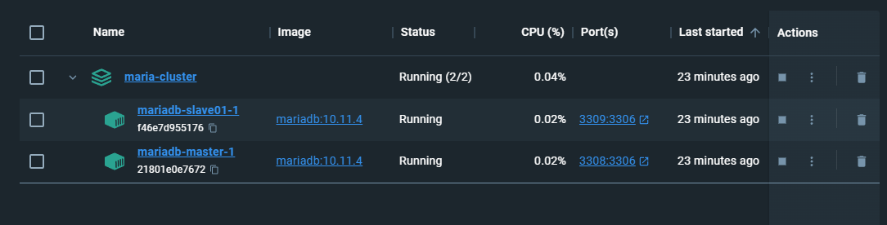
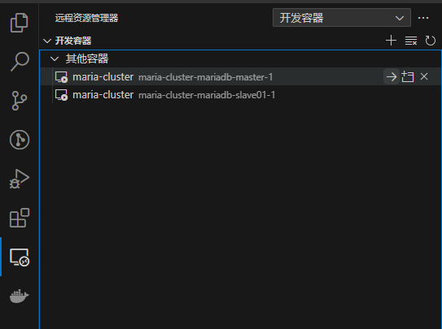
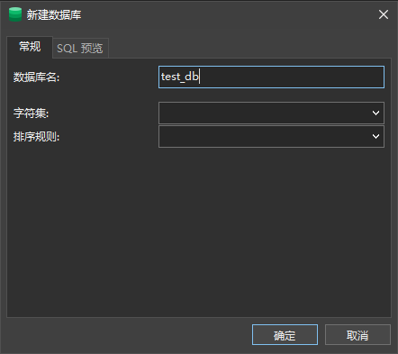

---
title: "MariaDb：基于GTID的主从复制以及基于MaxScale的读写分离"
date: 2023-07-25T15:15:26+08:00
tags: ["MariaDb", "MySQL", "Docker", "数据库优化"]
categories: ["数据库"]
---


## 开发环境
>- Winodws 10
>- Docker Desktop (基于WSL2)
>- Navicat Premium 16
>- Visual Studio Code

## MariaDb主从复制
### 概述
#### 关于MariaDB的主从复制
MariaDB中主从复制的工作方式如下：  
在主库中，所有对数据库的更新（DML和DDL），都将作为*binlog事件*写入到二进制日志(binlog)中。镜像库（从库）连接到主库并读取其binlog事件，然后在本地应用这些事件，由此来对主库的变更进行复制。一个数据库服务器是可以同时作为主库和从库的，因此二进制日志是可以多级传递的。  
镜像库会不断跟踪其主库的binlog偏移量，所以只要主库的binlog没有被删除，从库就能不断同步主库的变更。即使从库停摆或断连，也可以根据断连前记录的偏移量继续对主库进行同步。

#### 关于全局事务ID（GTID）
全局事务ID在二进制日志的事件组（binlog事件的集合，类似于事务）引入了一个新的事件，当一个事件组从主库复制到从库时，就会保存一个GTID，GTID在整个集群中都是全局唯一的，因此可以轻松地在相同的binlog事件中识别不同的从库。

#### 官方文档
<https://mariadb.com/kb/en/gtid/>

---

### 容器准备
#### 拉取容器
首先在docker中拉取MariaDB镜像，这里的版本使用10.11.4
``` sh
docker pull mariadb:10.11.4
```

#### 配置Docker Compose
这里使用一主一从作为数据库集群，为方便测试，在同一台机器上运行，并用[Docker Compose](https://docs.docker.com/compose/compose-file/)编排。  
主库容器名为 mariadb-master，从库容器名为 mariadb-slave01  
分别暴露3308和3309端口，并使用环境变量的方式配置mariadb默认用户(root)的密码。

compose.yaml:
```yaml
version: "2.18.1"

services:
  mariadb-master:
    image: mariadb:10.11.4
    ports:
      - "3308:3306"
    volumes:
      - MariaDb_Master:/etc/mysql 		#配置
      - MariaDb_Master:/var/lib/mysql 	#数据
      - MariaDb_Master:/var/log/mysql 	#日志
    environment:
      - MYSQL_ROOT_PASSWORD=123456

  mariadb-slave01:
    image: mariadb:10.11.4
    ports:
      - "3309:3306"
    volumes:
      - MariaDb_Slave01:/etc/mysql 		#配置
      - MariaDb_Slave01:/var/lib/mysql 	#数据
      - MariaDb_Slave01:/var/log/mysql 	#日志
    environment:
      - MYSQL_ROOT_PASSWORD=123465
      

volumes:
  MariaDb_Master:
  MariaDb_Slave01:
```


运行docker-compose，项目名为 *maria-cluster*
```sh
docker-compose -p maria-cluster up
```

结果如下所示


---

### 配置MariaDB
示例中的环境为基于WSL2的docker，使用 **VSCode+Dev Containers** 插件来更方便地访问容器中的文件。




打开VSCode并连接到容器 **mariadb-master** ，对主库进行配置  
打开`/etc/mysql/`下的`my.cnf`文件，对其添加内容：
```ini
[mysqld]
#服务器ID
server_id = 11
#启用二进制日志
log_bin = mysql-bin
#binlog过期天数
expire_logs_days = 30
#表名不区分大小写
lower_case_table_names = 1 
#二进制日志文件格式
binlog_format = ROW
#将主从复制期间从库接收到的更新记录到从库的二进制日志中（链式复制），从库首先也要开启二进制记录此项配置才能生效
log_slave_updates = 1
#复制的数据库将会在设定次数的事务后进行同步，如果设置为0，则依赖于操作系统刷新
sync_master_info = 1
#从库并行复制线程
slave_parallel_threads = 3
#启用主库效验
master_verify_checksum = 1
#指定对于二进制日志的校验类型
binlog_checksum = CRC32
#启用从库效验
slave_sql_verify_checksum = 1
```

连接到容器 **mariadb-slave01**，对从库进行配置  
同样打开`/etc/mysql/`下的`my.cnf`文件，对齐添加内容：
```ini
#此数据库为从库01
[mysqld]
#服务器ID
server_id=12
#启用二进制日志
log-bin= mysql-bin 
#从库中继日志名
relay_log = relay-bin
#表名不区分大小写
lower_case_table_names = 1
```

> 配置可根据需求自定义，详见[Binlog System Variables](https://mariadb.com/kb/en/replication-and-binary-log-system-variables)

---

### 创建并授权同步账户
使用Navicat（或其他方式），连接到Docker中的主库（**localhost:3308**）并创建账号：
```sql
GRANT ALL PRIVILEGES ON *.* TO dbsync @'%' IDENTIFIED BY '123456';
```
上述命令会创建名为 *"dbsync"* 的用户，密码为 123456，并在所有数据库中拥有所有权限。

使用`FLUSH PRIVILEGES`命令刷新权限，然后查看MASTER的状态：
```sql
SHOW MASTER STATUS
```
将得到类似以下的信息，记录了二进制日志以及其偏移量：
|File|Position|Binlog_Do_DB|Binlog_Ignore_DB|
|-|-|-|-|
mysql-bin.000005|626|||

根据这些日志文件名和偏移量可查看此时Master的GTID：
```sql
SELECT BINLOG_GTID_POS('mysql-bin.000005', 626);
```
|BINLOG_GTID_POST('mysql-bin.000005',626)|
|-|
|0-11-2|

接着同步账号到从库（**localhost:3309**）：
```sql
SET GLOBAL gtid_slave_pos="0-11-2"; -- 配置gtid
CHANGE MASTER TO 
-- 跨容器访问
MASTER_HOST="mariadb-master", -- 主库HOST
MASTER_PORT=3306, -- 主库端口
-- 使用刚才创建的账户远程连接主库
MASTER_USER="dbsync", -- 在主库中创建的用户名
MASTER_PASSWORD="123456", -- 密码
MASTER_LOG_FILE="mysql-bin.000006", -- 刚才得到的二进制日志名
MASTER_LOG_POS=342, -- 二进制日志偏移量
MASTER_USE_GTID=slave_pos; -- 在GTID 模式下复制并使用gtid_slave_pos作为位置开始从主数据库下载事务

START SLAVE; -- 开启从库
```
> 对于 `CHANGE MASTER TO` 的更多配置，参考[Change Master To](https://mariadb.com/kb/en/change-master-to/)

查看从库状态：
```sql
SHOW SLAVE STATUS
```


可以看到`Slave_IO_Running`和`Slave_SQL_Running`两项为YES，并且`Slave_IO_State`为"正在等待主库发送事件"，即代表主从复制配置成功。

---

### 测试主从复制
在主库中建立一个测试数据库  


随便导入一段数据库结构进行测试  


刷新从库，发现数据库已从主库同步  


对主库插入几条数据进行测试：
```sql
INSERT INTO `order` ( `OrderNo`, `CreateTime`, `CompanyID`, `SchduleDeliveryDate`, `OrderType`, `OrderSort`, `CadDataType`, `Deleted`, `ProcessState`, `IsBatch`, `ShardKey` )
VALUES
	( 20220104020855, '2022-01-04 10:06:46', 1455, '0001-01-01 00:00:00', 1, 0, 2, 0, NULL, 0, 22010 );
INSERT INTO `order` ( `OrderNo`, `CreateTime`, `CompanyID`, `SchduleDeliveryDate`, `OrderType`, `OrderSort`, `CadDataType`, `Deleted`, `ProcessState`, `IsBatch`, `ShardKey` )
VALUES
	( 20220104020856, '2022-01-04 14:18:42', 1455, '0001-01-01 00:00:00', 1, 0, 2, 0, NULL, 0, 22010 );
INSERT INTO `order` ( `OrderNo`, `CreateTime`, `CompanyID`, `SchduleDeliveryDate`, `OrderType`, `OrderSort`, `CadDataType`, `Deleted`, `ProcessState`, `IsBatch`, `ShardKey` )
VALUES
	( 20220104020857, '2022-01-04 14:32:35', 1455, '0001-01-01 00:00:00', 1, 0, 2, 0, NULL, 0, 22010 );
INSERT INTO `order` ( `OrderNo`, `CreateTime`, `CompanyID`, `SchduleDeliveryDate`, `OrderType`, `OrderSort`, `CadDataType`, `Deleted`, `ProcessState`, `IsBatch`, `ShardKey` )
VALUES
	( 20220104020858, '2022-01-04 15:08:22', 1455, '0001-01-01 00:00:00', 1, 838, 2, 0, 5, 0, 22010 );
```
可知从库已从主库同步：


## 基于MaxScale的读写分离
### 概述
#### MaxScale
MaxScale是MariaDb的一个数据库代理中间件，它将数据库语句转发到一个或多个数据库服务器。  
MaxScale为应用程序提供负载均衡以及各种高可用性功能，通过将它与MariaDb底层数据库架构分离来简化应用程序开发。

### 使用MaxScale前的数据库配置
在主库中创建MaxScale的认证用户
```sql
CREATE USER 'maxscale'@'%' IDENTIFIED BY '123456';
GRANT SELECT ON `mysql`.* TO 'maxscale'@'%';
GRANT SHOW DATABASES ON *.* TO 'maxscale'@'%';
```
在主库中创建MaxScale的监控账号
```sql
CREATE USER 'maxscale_monitor' @'%' IDENTIFIED BY '123456';
GRANT REPLICATION CLIENT ON *.* TO 'maxscale_monitor' @'%'; -- 复制客户端用于监控复制过程
GRANT REPLICATION SLAVE ON *.* TO 'maxscale_monitor' @'%';  -- 从库复制权限
GRANT SUPER,RELOAD ON *.* TO 'maxscale_monitor' @'%';       -- SUPER和RELOAD权限用于自动故障转移
GRANT SHOW DATABASES ON *.* TO 'maxscale_monitor' @'%';
```
在主库中创建MaxScale连接账号
```sql
CREATE USER 'azusa' @'%' IDENTIFIED BY '123456';
GRANT ALL PRIVILEGES ON *.* TO 'azusa' @'%';
FLUSH PRIVILEGES;
```
> 即应用程序通过MaxScale连接MariaDb所用的账号，用户名为'azusa'，密码为'123456'

### 安装MaxScale
在Docker中拉取MaxScale
```sh
docker pull mariadb/maxscale:23.02
```
修改Docker Compose，将MaxScale服务加入
```yaml
version: "2.18.1"

services:
  mariadb-master:
    image: mariadb:10.11.4
    ports:
      - "3308:3306"
    volumes:
      - MariaDb_Master:/etc/mysql 		#配置
      - MariaDb_Master:/var/lib/mysql 	#数据
      - MariaDb_Master:/var/log/mysql 	#日志
    environment:
      - MYSQL_ROOT_PASSWORD=20020816

  mariadb-slave01:
    image: mariadb:10.11.4
    ports:
      - "3309:3306"
    volumes:
      - MariaDb_Slave01:/etc/mysql 		#配置
      - MariaDb_Slave01:/var/lib/mysql 	#数据
      - MariaDb_Slave01:/var/log/mysql 	#日志
    environment:
      - MYSQL_ROOT_PASSWORD=20020816
      
  maxscale:
    image: mariadb/maxscale:23.02
    ports:
      - "4008:4008" # 配置4008端口用于读取
      - "4006:4006" # 配置4006端口用读写
      - "8989:8989" # 配置8989端口用于访问MaxScale GUI
    volumes:
      - MaxScale_Conf:/etc/maxscale.cnf.d
    environment:
      - TZ=Asia/Shanghai

volumes:
  MariaDb_Master:
  MariaDb_Slave01:
  MaxScale_Conf:
```
`compose up`运行容器，即可启用MaxScale。

### MaxScale配置
使用VSCode远程连接到MaxScale容器，在 `/etc/maxscale.cnf.d` 目录下新建一个配置文件 `my-maxscale.cnf` 对MaxScale进行配置

my-maxscale.cnf:
```ini
# https://mariadb.com/kb/en/mariadb-maxscale-24-mariadb-maxscale-configuration-guide/

# 定义数据库后端服务
# 主库
[server1]
type=server
address=mariadb-master
port=3306
protocol=MariaDBBackend

# 从库1
[server2]
type=server
address=mariadb-slave01
port=3306
protocol=MariaDBBackend

# MaxScale监控模块，能够自动判断主从，完成自动故障转移的操作（需要授予权限）
# https://github.com/mariadb-corporation/MaxScale/blob/2.3/Documentation/Monitors/MariaDB-Monitor.md
[MariaDb-Monitor]
type=monitor
module=mariadbmon
servers=server1,server2
# 使用创建的maxscale监控用户登入
user=maxscale_monitor
password=123456
monitor_interval=60000ms
# 强制从库只读
; enforce_read_only_slaves=1
auto_failover=true
auto_rejoin=true

# 负载均衡服务
[Read-Only-Service]
type=service
# 只读
router=readconnroute  
servers=server2         
# 使用maxscale认证用户登入
user=maxscale           
password=123456
router_options=slave

# 读写分离服务
# https://mariadb.com/kb/en/mariadb-maxscale-2302-readwritesplit/
# MaxScale通过监控模块获取服务器主从信息，自动把读取类语句转发给从库，写入类语句转发给主库。
# 修改变量类的操作将发送到所有服务器。
[Read-Write-Service]
type=service
router=readwritesplit
servers=server1,server2
# 使用maxscale认证用户登入
user=maxscale           
password=123456
filters=Hint
# 主库崩溃后所有写入操作返回错误，进入只读模式（没有设置此项默认是断开MaxScale连接）
master_failure_mode=error_on_write
# 如果一个从库被提升为主库，启用此项可以让数据库会话自动重连
master_reconnection=true

# MaxScale Hint
[Hint]
type=filter
module=hintfilter

# 监听器
# 使用定义的服务并暴露端口

[Read-Only-Listener]
type=listener
service=Read-Only-Service
protocol=MariaDBClient
port=4008

[Read-Write-Listener]
type=listener
service=Read-Write-Service
protocol=MariaDBClient
port=4006
```
> **MaxScale读写分离**  
> 数据库管理工具可通过暴露的读写分离端口（4006）来连接到MaxScale服务（连接方式和MariaDb一样）  
> MaxScale通过读取 *"mysql"* 数据库中的信息来自动判断定义的数据库后端服务的主从状态，接着把读取类型的语句转发给从库，而写入类型的语句转发给主库，从而实现读写分离。
> 关于更多MaxScale读写分离服务的配置参考：[ReadWriteSplit](https://mariadb.com/kb/en/mariadb-maxscale-2302-readwritesplit/)

> **关于MaxScale自动故障转移**    
> 假设当前有三台服务器：A(主，写)，B(从，读)，C(从，读)，若A服务器崩溃时，会立刻将一个从库服务器提升为新的主库。  
> 要实现自动故障转移首先需要启用MaxScale监控模块并配置自动故障转移，同时从库的也需要开启二进制日志和中继日志。并且需要设定GTID，避免从库的数据不同步。

重启maxscale容器，访问 `/var/log/maxscale/maxscale.log` 文件可查看MaxScale日志，确认没有异常后即可进行MaxScale的测试。

### MaxScale管理页面
MaxScale 2.5 版本后，即可通过访问容器的8989端口进入MaxScale的GUI管理页面，其内部使用MaxCtrl命令行对MaxScale进行实时监控和配置。

在Docker Compose中已经暴露了容器的8989端口，所以直接访问<localhost:8989>进入MaxScale GUI页面：


MaxGUI的用户认证与MaxCtrl一致，默认的用户名和密码是**admin**和**mariadb**。
MaxGUI可实时监控并管理MaxScale的状态：


> MaxGUI指南: <https://mariadb.com/kb/en/mariadb-maxscale-25-mariadb-maxscale-maxgui-guide/>  
> MaxCtrl: <https://mariadb.com/kb/en/mariadb-maxscale-2302-maxctrl/>


### 测试读写分离
因为此时开启了主从复制，所以两个数据库的数据都是同步的，没法从数据层面直接看出读写分离，但可以通过开启MariaDb全局日志的形式查看主库和从库执行的语句。  
对所有的数据库执行下面的语句：  
```sql
SET GLOBAL general_log = ON;-- 开启全局日志日志
SET GLOBAL general_log_file = '/tmp/general.log';-- 设置日志文件保存位置
```
> 容器重启后General Log会自动关闭

其他General Log常用的语句：
```sql
SHOW VARIABLES LIKE 'general_log';-- 查看全局日志是否开启
SET GLOBAL general_log = ON;-- 开启全局日志
SHOW VARIABLES LIKE 'general_log_file';-- 查看全局日志文件保存位置
SET GLOBAL general_log_file = '/tmp/general.log';-- 设置全局日志文件保存位置
SHOW VARIABLES LIKE 'log_output';-- 查看日志输出类型 table或file
SET GLOBAL log_output = 'table';-- 设置输出类型为 table
SET GLOBAL log_output = 'file';-- 设置输出类型为file
```

开启General Log后，即可通过查看保存路径下的日志开测试读写分离。  
打开Navicat（或其他方式），使用刚刚创建的用户 'azusa'-'123456' 连接到MaxScale(4006端口)。  
执行一段查询语句，然后查看日志文件，发现从库执行了语句：


执行一段插入语句，然后查看日志文件，发现主库执行了语句：


可见MaxScale成功进行了读写分离。

---

##
> 参考文章
> How to Install and Configure MaxScale for MariaDB: <https://severalnines.com/blog/how-install-and-configure-maxscale-mariadb/>  
> ariaDB主从复制+MaxScale读写分离和自动化故障转移: <https://www.somata.top/2020/mariadb_and_maxscale_cluster.html>  
> 基于GTID的MariaDB主从复制: <https://blog.csdn.net/weixin_34192732/article/details/93077543>  
> 探讨EF Core如何优雅的实现读写分离: <https://www.cnblogs.com/alphayu/p/14241406.html>  
> ANDC: <https://github.com/AlphaYu/adnc>  