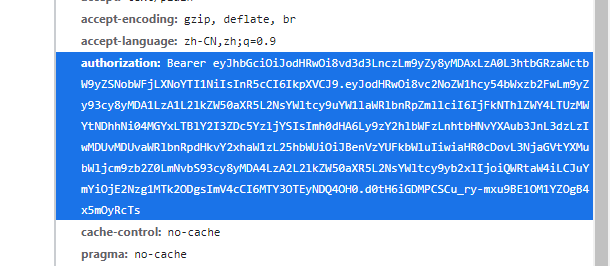
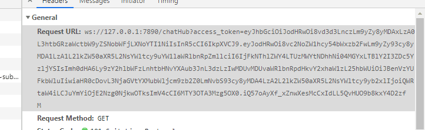

在使用SignalR向.NET后端进行实时通信时，时常会使用 AccessToken 进行用户授权。提供用户认证可以提高后端接口的安全性，并且可以利用SignalR的用户认证机制来向指定用户的所有SignalR连接发送消息。

## 后端用户授权服务
- ### 在 ASP.NET Core 中添加授权机制：

    ```
    Program.cs

    ...

    services.AddAuthentication(JwtBearerDefaults.AuthenticationScheme)
        //此处使用JWTBearer进行授权验证
        .AddJwtBearer(options =>
        {
            var secretKey = configurations.GetRequiredSection("Jwt").Get<JwtOption>().SecretKey??throw new ConfigurationErrorsException("Jwt密钥未配置");
            options.TokenValidationParameters = new()
            {
                ValidateIssuer = false,
                ValidateAudience = false,
                ValidateLifetime = true,
                ValidateIssuerSigningKey = true,
                IssuerSigningKey = new SymmetricSecurityKey(Encoding.UTF8.GetBytes(secretKey)),
            };
        });

    ...

    //添加认证机制需要引用Authentication与Authorization两个中间件
    app.UseAuthentication();
    app.UseAuthorization();

    ...
    ```

- ### 在SignalR集线器类上添加Authorize特性  
    详细的授权信息与不同的授权规则参考[ASP.NET Core授权](https://learn.microsoft.com/zh-cn/aspnet/core/security/authorization/introduction?view=aspnetcore-6.0)
    ```
    //添加授权
    [Authorize]
    public class ChatHub : Hub
    {
        public override async Task OnConnectedAsync()
        {
            await base.OnConnectedAsync();

            //在Hub类的Context.User属性中可以获取到SignalR通过websocket握手获取到的用户授权信息
            await Console.Out.WriteLineAsync(Context.User.Identity.Name);
        }
        
        ...
    }
    ```

    这样就为ASP .NET Core提供了基本的用户授权机制，在应用的终结点(endPoints)上添加[Autorize]特性来对此终结点进行用户授权。

<br>

## 在客户端配置SignalR连接的访问令牌  
- ### C#客户端
    ```
    ...

    _connection = new HubConnectionBuilder()
        .WithAutomaticReconnect()
        //在WithUrl方法的configureHttpConnection参数中配置
        .WithUrl(HubUrl, options =>
        {
            //为AccessTokenProvider提供获取访问令牌的委托
            //此处为应当查找并获取用户访问令牌的逻辑
            options.AccessTokenProvider = () => Task.FromResult(authorizationToken);
        });
        .ConfigureLogging(builder => builder.AddConsole())
        .Build();
    
    await _connection.StartAsync();

    ...

    ```

- ### Javascript客户端
    ```
    ...

    this.hubConnection = new signalR.HubConnectionBuilder()
        .withUrl("this.hubUrl",{ //为withUrl方法参数2的accessTokenFactory属性提供获取访问令牌的方法
            accessTokenFactory: () => this.getAccessToken(),
            skipNegotiation: true,
            transport: signalR.HttpTransportType.WebSockets
        })
        .build();
    await this.hubConnection.start();

    ...
    ```

<br>

## 踩坑注意
在Javascript客户端，即使配置了访问令牌，在对后端SignalR集线器进行访问时服务器仍然会响应 **401 Unauthorized** 或是客户端抛出 **SignalR Error: Failed to complete negotiation with the server** 异常，若排除了Javascript客户端配置问题或是CORS跨域访问问题，则有可能是因为Javascript websocket API不支持设置请求报文头的原因。 

客户端使用HTTP协议向服务器进行访问令牌验证常用的方式是在报文头中添加 *Authorization* 标头，并提供访问令牌字符串。


在SignalR进行Websocket连接前会进行协商(negotiation)，若客户端在建立SignalR连接时配置了访问令牌，则会在请求时附带上访问令牌。

但在SignalR Javascript客户端进行协商时，访问令牌并不是添加在报文头中，而是以查询字符串的形式发送请求。


ASP.NET Core并不会自动对查询字符串中的访问令牌进行授权，所以此时服务器将会返回 **401 Unauthorized** ，而Javascript客户端会抛出 **SignalR Error: Failed to complete negotiation with the server (无法完成与服务器的协商）** 异常。

### 解决方法：
在服务器端配置授权机制，在收到请求消息时手动进行授权处理。配置的方式有多种，较为简单的方式是直接在Authorization服务中添加事件：
```
program.cs

...

services.AddAuthentication(JwtBearerDefaults.AuthenticationScheme)
    //使用JwtBearer作为认证令牌
    .AddJwtBearer(options =>
    {
        var secretKey = configurations.GetRequiredSection("Jwt").Get<JwtOption>().SecretKey??throw new ConfigurationErrorsException("Jwt密钥未配置");
        options.TokenValidationParameters = new()
        {
            ValidateIssuer = false,
            ValidateAudience = false,
            ValidateLifetime = true,
            ValidateIssuerSigningKey = true,
            IssuerSigningKey = new SymmetricSecurityKey(Encoding.UTF8.GetBytes(secretKey)),
        };
        //添加授权事件，在收到请求消息时进行处理
        options.Events = new JwtBearerEvents()
        {
            OnMessageReceived =  context =>
            {
                //从请求查询字符串中取出访问令牌
                var accessToken = context.Request.Query["access_token"];
                //请求条件不符合则返回
                if (!string.IsNullOrEmpty(accessToken) && context.Request.Headers["Upgrade"] == "websocket")
                {
                    //手动对上下文中的令牌属性赋值，剩下的授权由.NET自动完成
                    context.Token = accessToken;
                }
                return Task.CompletedTask;
            }
        };
    });

...
```
<br>

参考文章
> https://stackoverflow.com/questions/21260384/signalr-authenticating-with-access-token#comment32085907_21260384