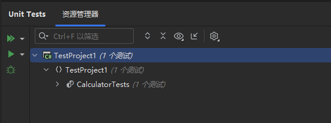
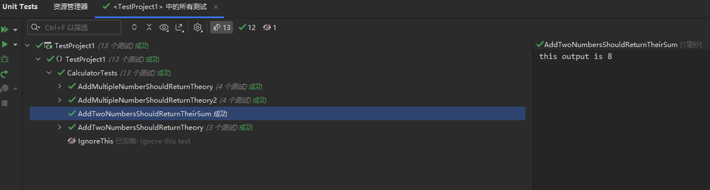

---
title: "使用xUnit编写单元测试"
date: 2023-07-12T11:28:47+08:00
tags: ["单元测试", "C#"]
categories: [".NET"]
series: []
---

## 先决条件
> 安装Nuget包 
> - Microsoft.Net.Test.Sdk
> - xunit
> - xunit.runner.visualstudio


假设现在有一个Calculator类需要测试：  
```cs
public class Calculator
{
    public double Curr { get; private set; }

    public double Add(double value)
    {
        Curr += value;
        return Curr;
    }
}
```

---

## 编写单元测试类
编写一个类进行单元测试，名为`CalculatorTests`  
```cs
public class CalculatorTests
{
    private readonly Calculator _sut; //_sut意思为system under test

    public CalculatorTests()
    {
        _sut = new Calculator();
    }
}
```
### 编写测试函数
编写函数进行测试，测试函数的命名应当明确地表达了测试的意图。  
比如函数需要对Add函数进行测试，推荐详细命名`AddTwoNumbersShouldReturnTheirSum`，而不是简单的`Test_Add`
```cs
[Fact]
public void AddTwoNumbersShouldReturnTheirSum()
{
    _sut.Add(3);
    _sut.Add(5);
    Assert.Equal(8, _sut.Value);
}
```
> - XUnit.Assert类提供了许多静态方法对结果进行验证
> - 为测试函数添加`[Fact]`特性来标记其为一个单元测试函数，被标记的单元测试会被IDE识别



点击IDE的"*执行单元测试*"按钮，可以一键执行项目中的单元测试。
> **Δ注意，IDE在进行单元测试时，每个单元测试函数是并行执行的，并且每个函数将创建单独的实例，并且互不影响**

### 忽略测试
如果暂时不想测试某个函数，为其`[Fact]或[Theory]`特性加上`Skip`属性即可：
```cs
[Fact(Skip = "Ignore this test")]
public void IgnoreThis()
{
    
}
```
> - Skip属性为字符串类型，解释忽略此测试的理由
> - 在IDE上运行单元测试时将忽略带有Skip属性的函数


### 添加参数
#### 内联参数
函数可接收参数作为测试数据，为函数标注`[Theory]`特性，并用`[InlineData]`特性注入参数：
```cs
[Theory]
[InlineData(13,5,8)]
[InlineData(0,-3,3)]
[InlineData(0,0,0)]
public void AddTwoNumbersShouldReturnTheory(double expected, double firstToAdd, double secondToAdd)
{
    _sut.Add(firstToAdd);
    _sut.Add(secondToAdd);
    Assert.Equal(expected, _sut.Value);
}
```
> - InlineData中的参数必须和函数声明的参数数量和类型一致
> - 标注多个InlineData可以提供多项测试数据

#### 成员参数
如果测试数据较为复杂，推荐使用`[MemberData]`来为其注入一个静态成员作为参数，这个成员可以是:   
1. 静态字段
2. 静态属性
3. 静态函数（在MemberData的参数列表中提供参数）

```cs
public static IEnumerable<object[]> TestData()
{
    return new[]
    {
        new object[] { 15d, new double[] { 5, 5, 5 } },
        new object[] { -10d, new double[] { 10, -30, 10 } },
        new object[] { 2d, new double[] { 1, 1 } },
        new object[] { 0d, new double[] { 1, -1, 2, -2 } },
    };
}

[Theory]
[MemberData(nameof(TestData))]
public void AddMultipleNumberShouldReturnTheory(double expected, params double[] numbers)
{
    foreach (var value in numbers)
    {
        _sut.Add(value);
    }

    Assert.Equal(expected, _sut.Value);
}
```
或者，使用`yield return`来获得更优雅的写法
```cs
public static IEnumerable<object[]> TestData()
{
    yield return new object[] { 15d, new double[] { 5, 5, 5 } };
    yield return new object[] { -10d, new double[] { 10, -30, 10 } };
    yield return new object[] { 2d, new double[] { 1, 1 } };
    yield return new object[] { 0d, new double[] { 1, -1, 2, -2 } };
}
```

> - MemberData的构造函数填写作为参数的类成员的名字
> - 成员的类型/返回值必须实现`IEnumerable<object[]>`接口  
> - 类型中的`object[]`即为测试函数的参数，其数量和类型必须于函数的参数一致，而`IEnumerable`接口则允许提供多组数据
> - 执行单元测试时将会把该成员提供的数据全部测试一遍

#### 类参数
和成员参数类似，可以将测试内容放在另一个类而不是成员中，通过标注`[ClassData]`特性来指定测试类。
```cs
public class AddData : IEnumerable<object[]>
{
    public IEnumerator<object[]> GetEnumerator()
    {
        yield return new object[] { 15d, new double[] { 5, 5, 5 } };
        yield return new object[] { -10d, new double[] { 10, -30, 10 } };
        yield return new object[] { 2d, new double[] { 1, 1 } };
        yield return new object[] { 0d, new double[] { 1, -1, 2, -2 } };
    }

    IEnumerator IEnumerable.GetEnumerator()
    {
        return GetEnumerator();
    }
}

[Theory]
[ClassData(typeof(AddData))]
public void AddMultipleNumberShouldReturnTheory2(double expected, params double[] numbers)
{
    foreach (var value in numbers)
    {
        _sut.Add(value);
    }

    Assert.Equal(expected, _sut.Value);
}
```
> - ClassData的参数填写测试类的类型
> - 与成员参数类似，测试类必须实现`IEnumerable<object[]>`接口，并在`GetEnumerator`函数中返回测试内容

#### 结果输出
有时想要在控制台上看到单元测试的输出内容，但在单元测试中使用Console.WriteLine是无效的。若要输出内容需要在测试的类中通过构造函数注入`ITestOutputHelper`类型的字段（XUnit自动注入），并用其进行输出。
```cs
public class CalculatorTests
{
    private readonly Calculator _sut;
    private readonly ITestOutputHelper _output;

    public CalculatorTests(ITestOutputHelper output)
    {
        _output = output;
        _sut = new Calculator();
    }

    [Fact]
    public void AddTwoNumbersShouldReturnTheirSum()
    {
        _sut.Add(3);
        _sut.Add(5);
        Console.WriteLine("this output is "+ _sut.Value.ToString(CultureInfo.CurrentCulture));
        Assert.Equal(8, _sut.Value);
    }
    ...
}
```
输出的结果将在IDE的单元测试上显示，并且会区分每个单元测试的每组测试的输出内容：


#### 共享上下文的单元测试
在[编写测试函数](./#编写测试函数)时提到过在进行单元测试时，每个测试函数将会在不同的实例中运行。但在某些情况下会希望不同的单元测试使用同一个字段（比如`dbContext`），xUnit也提供了这样的配置。

令当前单元测试类实现`IClassFixture<>`接口，并使用需要单元测试共享的字段类型作为泛型参数，同时从构造函数中注入该字段。这样该类中所有的单元测试都将共享该字段实例。
```cs
public class CalculatorTests : IClassFixture<Calculator>
{
    private readonly Calculator _sut;
    private readonly ITestOutputHelper _output;

    public CalculatorTests(ITestOutputHelper output, Calculator sut)
    {
        _output = output;
        _sut = sut;
    }
    ...
}
```

> - 实现多个`IClassFixture`接口来共享多个不同的类型字段
> - 如果测试类中的字段实现了`IDisposable`接口并且希望执行完单元测试后被关闭，让测试类也实现`IDisposable`并在`Dispose`函数中关闭即可，xUnit执行完每一个单元测试以后将会自动运行`Dispose`函数。

#### 共享上下文的单元测试类
类似于[共享上下文的单元测试](./共享上下文的单元测试)，xUnit还可以让多个单元测试类共享上下文，首先需要定义一个"*集合(collection)*"：
```cs
[CollectionDefinition("Database collection")]
public class DatabaseCollection : ICollectionFixture<DatabaseFixture>
{
}
```
这个类不需要任何成员，只需要声明即可。令其实现`ICollectionFixture<>`并在泛型参数中填入想要共享的字段类型，然后添加`[CollectionDefinition("Database collection")]`特性声明一个名为"***Database collection***"的上下文集合。

> - 和`IClassFixture`相同，`ICollectionFixture<>`也可以实现多个
> - `CollectionDefinition`特性的构造函数接收一个字符串"**name**"作为"集合名"，作为一个上下文集合的名字
> - 同一个上下文集合中的所有类都可以注入`ICollectionFixture`接口指定的字段类型，注入的字段均为同一个实例

然后，在每个需要共享上下文的单元测试类上标注`[Collection("Database collection")]`特性，使其加入名为"***Database collection***"的上下文集合。xUnit将向他们注入`DatabaseFixture`类型的对象，并且均为同一个实例。
```cs
[Collection("Database collection")]
public class DatabaseTestClass1
{
    DatabaseFixture fixture;

    public DatabaseTestClass1(DatabaseFixture fixture)
    {
        this.fixture = fixture;
    }
}

[Collection("Database collection")]
public class DatabaseTestClass2
{
    // ...
}
```
##
> 详情参考[官方文档](https://xunit.net/docs/shared-context)

