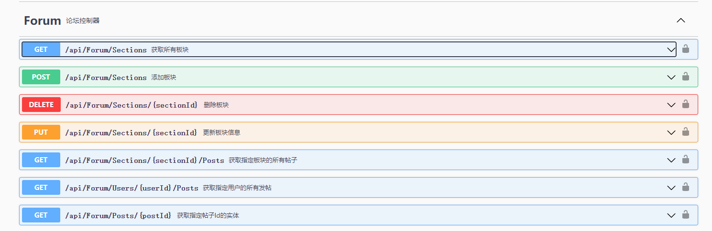

## Swagger文档
在ASP .NET Core项目中配置Swagger服务，在Swagger页面的接口中显示C#代码的注释。



[微软官方文档](https://learn.microsoft.com/zh-cn/aspnet/core/tutorials/getting-started-with-swashbuckle?view=aspnetcore-6.0&tabs=visual-studio)

> **先决条件：** 项目需要在Nuget中安装Swashbuckle.AspNetCore包（一般会在ASP .NET Core项目创建时自动安装）

1. ## 生成并导出XML文档
    首先需要生成项目的XML文档。以 Visual Studio 为例，在项目属性-输出中勾选“生成包含API文档的文件”，并指定输出目录：  
    
    
    接着生成项目，会在指定目录下输出XML文档：  
    

2. ## 配置Swagger服务
    在 StartUp 中配置服务
    
    program.cs
    ```cs
    //安装Nuget包后即可使用AddSwaggerGen方法添加Swagger服务
    services.AddSwaggerGen(options =>
    {
        //定义Swagger文档，可多次定义以区分版本
        //此时定义的文档名为v1
        options.SwaggerDoc("v1", new OpenApiInfo()
        {
            //添加一些API信息，将会呈现在Swagger页面上
            Version = "v1",
            Title = "用户信息控制器",
        });
        //指定XML文档的目录
        options.IncludeXmlComments($"{Path.GetDirectoryName(Assembly.GetExecutingAssembly().Location)}\\{Assembly.GetExecutingAssembly().GetName().Name}.xml", true);

        ...
    });
    ```

3. ## 配置Swagger中间件
    在ASP .NET Core入口函数中配置中间件
    
    program.cs 
    ```cs
    ...

    var app = builder.Build();

    //此时在开发环境下才会添加Swagger中间件
    if (app.Environment.IsDevelopment())
    {
        //添加Swagger中间件
        app.UseSwagger();
        //添加SwaggerUI中间件，在参数中指定Swagger终结点，终结点错误将会导致接口无法正常显示
        //此时使用终结点是步骤2中声明的名为"v1"文档，如果定义了多个文档版本，则需要指定多个终结点
        app.UseSwaggerUI(c => c.SwaggerEndpoint("/swagger/v1/swagger.json", "Gehenna.WebAPI v1"));
    }
    ```
    > 如果使用IIS 或反向代理的路径，请使用 `./` 前缀将 Swagger 终结点设置为相对路径。 例如 `./swagger/v1/swagger.json`。   
    使用 `/swagger/v1/swagger.json` 指示应用在 URL 的真实根目录中查找 JSON 文件（如果使用，加上路由前缀）。例如，请使用 `https://localhost:<port>/<route_prefix>/swagger/v1/swagger.json` 而不是 `https://localhost:<port>/<virtual_directory>/<route_prefix>/swagger/v1/swagger.json`。

4. ## 配置完成
    在API控制器类或终结点方法上添加XML注释。  
    
    
    

    配置完成后，访问`https://localhost:<port>/<route_prefix>/swagger/index.html`页面上即可进入Swagger界面。

    页面的标题文字将显示配置Swagger服务时提供的数据。  
    

    页面右上方的下拉框可以选择在步骤2/3中定义的Swagger的版本  
    

    页面中将会显示控制器，API终结点方法的注释
    

    如果给方法参数添加了注释，Swagger也会显示出来
    

    如果请求/响应的数据模型有添加注释，点击`scheme`显示
    

5. ## 在使用泛型作为API响应数据模型时显示注释
    //待补充

> 参考文章：https://learn.microsoft.com/zh-cn/aspnet/core/tutorials/getting-started-with-swashbuckle?view=aspnetcore-7.0&tabs=visual-studio