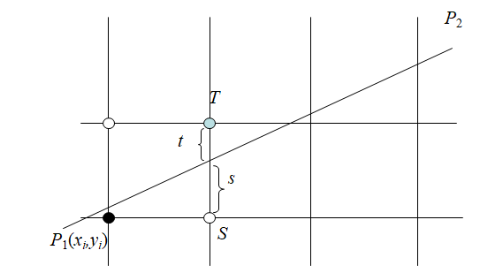
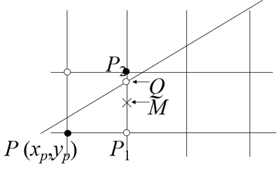

---
title: "复习 计算机图形学基础 第三章 -- 1. 直线生成算法"
date: 2023-06-15T16:25:26+08:00
tags: ["计算机图形学"]
categories: ["期末复习"]
series: ["复习 计算机图形学基础"]
---



## 数值微分法(DDA)
DDA算法是根据直线的微分方程来计算Δx或Δy生成直线的扫描转换算法。在一个坐标轴上以**单位间隔**对线段取样, 以决定另一个坐标轴方向上**最靠近理想线段**的整数值。  


设\\((x_0, y_0)\\)为直线段的始点, \\((x_n, y_n)\\)为直线段的终点，且端点坐标均为整数, 则直线的微分方程为

$$
\frac{dy}{dx} = \frac{Δy}{Δx} = \frac{y_n - y_0}{x_n - y_0} = k，(k即为直线的斜率)
$$

当  \\(|k| \leq 1\\) 时，应当取x方向为步长方向，每次步进一个单位，则有：
$$
x_{x+1} = x_i \pm 1
$$

$$
y_{y+1} = x_i \pm k
$$


当 \\(|k| > 1\\) 时，应当取y方向为步长方向，则有：
$$
x_{i+1} = x_i \pm \frac{1}{k}
$$
$$
y_{i+1} = y_i \pm 1
$$

> **总结**
> 首先求出直线斜率k:\\(\frac{Δy}{Δx}\\)，根据k的大小决定画线的步进方向：  
>  - 如果 \\(|k|\leq1\\)，则画线时以X轴为步进方向，每次x步进1，y步进k  
>  - 如果 \\(|k| > 1\\)，那么画线时以Y轴为步进方向，每次x步进\\(\frac{1}{k}\\)，y步进1  
> 
> 具体步进的方向为正半轴还是负半轴要取决于直线的斜率，在做题时只需要知道朝着**目标点\\((x_n,y_n)\\)步进**就行了。

```cpp
void LineDDA(int x1, int y1, int x2, int y2)
{
    int dm=0; 
	if (abs(x2-x1)>= abs(y2-y1)) //abs是求绝对值的函数
		dm=abs(x2-x1);  //x为计长方向
	else
		dm=abs(y2-y1); //y为计长方向
	float dx=(float)(x2-x1)/dm;  //当x为计长方向时，dx的值为1
	float dy=(float)(y2-y1)/dm;  //当y为计长方向时，dy的值为1
	float x=x1;  //取整操作
	float y=y1; //取整操作
	for (int i=0; i< dm; i++)
	{
		setpixel( (int)(x+0.5), (int)(y+0.5));//在屏幕上绘制该点
		x+=dx;
		y+=dy;
	}
}
```


## Bresenham算法
在将直线光栅化时，假设直线的斜率 \\(k \geq 0\\)，起点为 \\(P_0 (x_0,y_0)\\)，终点为 \\(P_n (x_n,y_n)\\)。  
从起点\\(P_0\\)开始，每次在水平方向上朝着终点\\(P_n\\)移动一个像素，由于受到斜率 k 的影响，直线每个像素的下一个要绘制的像素点要么是右边的点S，要么是右上的点T：



Bresenham画线算法即是使用了这个判别方式：  
由上图所示，可知S的坐标为\\((x_{i+1},y_i)\\)，T的坐标为\\((x_{i+1},y_{i+1})\\)  
并且直线方程可以表示为
$$
y = kx+b
$$

因此有：
$$
\begin{cases}
s &= y-y_i=k(x_i+1)+b-y_i \\\
t &= y_i+1-y=Y_i+1-k(x_i+1)-b
\end{cases}
$$

如果 \\(t \leq s\\)，则代表直线靠上方的点近一点，则下一个绘制的像素点应当选择右上方的，  
如果 \\(t > s\\)，则代表直线靠下方的点近一点，则下一个绘制的像素点应当选择右方的。  
注意这只适用于直线的斜率\\(k \geq 0\\)的情况  

然后代入 \\(k = \frac{dy}{dx}\\)，有

$$
\begin{split}
dx(s-t)&=2dy(x_i+1)+2bdx-2y_idx-dx \\\
&=2(x_idy-y_idx)+(2dy+2bdx-dx)
\end{split}
$$

因为 dx > 0，所以可以以 dx(s-t) 的正负作为选择S或T的依据，所以设 \\(d_i=dx(s-t)\\)  
将下标加一，有

$$
\begin{split}
d_{i+1} &= 2(x_{i+1}dy-y_{i+1}dx)+(2dy+2bdx-dx) \\\
        &= d_i+2dy(x_{i+1}-x_i)-2dx(y_{i+1}-y_i)
\end{split}
$$

因为在水平方向上移动，所以 \\(x_{i+1}-x_i=1\\)，代入得
$$
d_{i+1}=d_i+2dy-2dx(y_{i+1}-y_i)
$$
这样就获得了一个递推公式，下一个\\(d_{i+1}\\)可以由前一个\\(d_i\\)递推得到  
通过计算当前点的$d_i$，可以判断向终点\\(P_n\\)移动时，下一个绘制的像素点应当选择右上方还是右方的。  

如果 \\(d_i \geq 0\\) ，即 \\(t \leq s\\)，下一个点选择右上方的，选择右上方的点满足了 \\(y_{i+1}-y_i=1\\)，所以将 \\(d_i\\) 改为
$$
Δ重点\ \ 
d_{i+1}=d_i+2(dy-dx)
$$

如果 \\(d_i<0\\) ，即 \\(s<t\\) 下一个点应当选择右方的，此时满足了 \\(y_{i+1}=y_i\\)，则有
$$
Δ重点\ \ 
d_{i+1}=d_i+2dy
$$

在开始绘制时，需要先知道 \\(d_i\\) 的初值 \\(d_0\\)，因为在开始绘制时，i=1，\\(b=y_1-kx_1\\)，可代入上文 \\(d_i\\)的公式得出：
$$
\begin{split}
Δ重点\ \ 
d_0 &=dx(s-t) \\\
    &= 2(x_idy-y_idx) + (2dy + 2bdx-dx) \\\
    &= 2dy-dx 
\end{split}
$$
从起点 \\(P_0\\) 开始向终点 \\(P_n\\) 移动，每次在X轴上步进一个像素，并求出当前的 \\(d_i\\) ，即可知道下一个点所在方位（右或右上）。  

注意，上面讨论的是直线斜率 \\(0 \leq k \leq 1\\)的情况，对于一般情况可做如下处理：  

1. **当 \\(|k|>1\\) 时，将x、y和dx、dy对换，即以Y轴做增长方向**，y总是增长1（或减少1，取决于dx，dy的符号）  
所以x的操作取决于 \\(d_i\\) 的符号： \\(d_i \geq 0\\) 时，x增加1（或减少1）； \\(d_i < 0\\) 时，x不变。
2. 需要根据dx和dy的符号来判断x或y每次步进应当加一还是减一，如果 dx(或dy) < 0 ，那么每次x轴步进（或y轴步进）就应当减一，在做题时，只需要知道**朝终点方向步进**就行了。  

> **总结**  
> 1. 求出dy和dx的值，并计算斜率k  
> 2. 判断步进方向：
>    - \\(|k|\leq 1\\)时，X轴为步进方向
>    - \\(|k|>1\\)，Y轴为步进方向
>    - 当\\(dx > 0\\) 时，朝X正半轴步进，反之则负半轴
>    - 当\\(dy > 0\\) 时，朝Y正半轴步进，反之则负半轴
> 3. 设当前直线斜率 \\(|k| \leq 1\\)，并且 dx,dy 均大于0。  
>    开始绘制直线，从原点开始 求判别式 \\(d_i\\) 的值，初值 \\(d_1\\) 为 \\(2dy-dx\\)，  
>    每次朝步进方向轴移动，此时是X轴，则x值+1  
>    根据 \\(d_i\\) 的值判断另一个轴（此时是Y轴）的状态：  
>    - 如果 \\(d_i \geq 0\\) ，则y的值+1  
>    - 如果 \\(d_i < 0\\) ，则y不变  
>
>    下一次步进所用的 \\(d_{i+1}\\) 要由本次的 \\(d_i\\) 递推得到，所以计算 \\(d_{i+1}\\)：
>    - 如果当前的 \\(d_i \geq 0\\) ，\\(d_{i+1}=d_i+2(dy-dx)\\)
>    - 如果当前的 \\(d_i < 0\\) ，\\(d_{i+1}=d_i+2dy\\)
>    注意，在做题时要根据终点的方向来判断每次步进是朝着正半轴（+1）还是负半轴（-1）
> 4. 然后按照上面的顺序持续步进，直到抵达终点
> ---
> 例：
> 从点 A(0,0) 到 B(5,4) 用 Bresenham 算法画一直线，写出绘制流程：  
> dx = 5 - 0 = 5  
> dy = 4 - 0 = 4  
> k = dy / dx = 0.8  
> 即朝X轴步进，x和y都朝正半轴移动
> 每次步进选择的像素以及 $d_i$ 值如下表：
> |X|Y|$d_i$|操作|
> |---|---|---|---|
> |0|0|3| \\(d_i \geq 0\\)，y值+1|
> |1|1|1| \\(d_i \geq 0\\)，y值+1|
> |2|2|-1| \\(d_i < 0\\)，y值不变|
> |3|2|7| \\(d_i \geq 0\\)，y值+1|
> |4|3|5| \\(d_i \geq 0\\)，y值+1|
> |5|4|3| 抵达终点|

```cpp
void Bres_Line(int x1, int y1, int x2, int y2)
{
	setpixel(x1,y1);
	int dx=abs(x2-x1),dy=abs(y2-y1);
        if ( dx==0 && dy==0)   return; 
        int flag=0;
        if (dx<dy)       //下面将斜率变换至0≤|k|≤1区间
        {
	        flag=1;
	        swap_value(&x1, &y1); swap_value(&x2, &y2); swap_value(&dx, &dy);
        }
        int tx=(x2-x1) >0 ? 1:-1,ty=(y2-y1)>0 ? 1: -1;
        int curx=x1,cury=y1;
        int dS=2*dy,dT=2*(dy-dx),d=dS-dx; 
        while (curx!=x2)
       {
            if (d<0) 
	        d+=dS;
	      else
	  	cury+=ty, d+=dT; 
	      curx+=tx;
            if (flag)
	        setpixel(cury, curx);  
           else 
	        setpixel(curx, cury); 
        }

}
```

## 中点画线算法
中点画线算法与Bresenham算法类似，两者的规则有所不同，但是总体思想是一致的，并且效率也完全相同。

  

假定直线斜率 0<k<1 ，且已确定当前处理过的像素点P(xp,yp)，则下一个与直线最接近的像素只能是P1或P2。设M为P1与P2的中点，Q为交点。现确定下一个要画的像素的位置。
- 如果M在Q下方，则P2离直线近，取P2；
- 如果M在Q上方，则P1离直线近，取P1。
- M与Q重合，P1、P2任取一点。

根据直线方程
$$
\begin{split}
𝐹(𝑥,𝑦)&=𝑎𝑥+𝑏𝑦+𝑐=0 \\\
𝑎&=𝑦_0−𝑦_1\\\
𝑏&=𝑥_1−𝑥_0\\\
𝑐&=𝑥_0 𝑦_1−𝑥_1 𝑦_0
\end{split}
$$

可知对于直线上的点，将坐标代入后 F(x,y) 将等于0；  
 - 对于直线上方的点，F(x,y) > 0；  
 - 对于直线下方的点，F(x,y) < 0。  

因此，如果要判断上图中的M点在Q点的上方还是下方，只需要把M点代入方程，并判断符号即可。M点是P1和P2的中点，所以它的坐标为\\((x_p+1,y_p+0.5)\\)。  
代入到直线方程中，可构造判别式：
$$
\begin{split}
𝑑&=𝐹(𝑥_𝑝+1, 𝑦_𝑝+0.5) \\\
&=𝑎(𝑥_𝑝+1)+𝑏(𝑦_𝑝+0.5)+𝑐
\end{split}
$$

---

当 \\(d_i \geq 0\\) 时，即M点在Q点上方，那应该取P1点。并且，可以通过当前 \\(d_i\\) 的值递推出 \\(d_{i+1}\\) 的值：
$$
\begin{split}
Δ重点\ \ 
d_{i+1}&=F(x_p+2, y_p+0.5) \\\
&=a(x_p+2)+b(y_p+0.5)+c \\\
&=a(x_p+1)+b(y_p+0.5)+c+a \\\
&= d+a
\end{split}
$$

而当 \\(d_i < 0\\) 时，即M点在Q点下方，则应当取P2点，计算\\(d_{i+1}\\) 的值：
$$
\begin{split}
Δ重点\ \ 
d_{i+1}&=F(x_p+2, y_p+1.5) \\\
&=a(x_p+2)+ b(y_p+1.5)+c \\\
&=a(x_p+1)+b(y_p+0.5)+c+a+b \\\
&=d+a+b
\end{split}
$$

画线从(x0, y0)开始，所以 \\(d_i\\) 的初值应该是：
$$
\begin{split}
Δ重点 \ \ 
d_0&=F(x_0+1,y_0+0.5) \\\
&=a(x_0+1)+b(y_0+0.5)+c \\\
&=F(x_0,y_0)+a+0.5b \\\
&=a+0.5b
\end{split}
$$

用同样的推导过程，当直线斜率-1<k<0时：
 - 当d≥0，此时 \\(d_{i+1}=d-a\\)
 - 当d<0，此时 \\(d_{i+1}=d-a+b\\)

当斜率|k|>1时，将x,y坐标互换以完成递推过程。在画点时再将x,y坐标互换。

> **总结**  
> 1. 根据起点和终点的坐标，可以使用两点式 \\((y-y_1)/(x-x_1)=(y_2-y_1)/(x_2-x_1)\\) 求出其直线方程 \\(ax + by + c = 0\\)  
> 2. 计算 \\(d_i\\) 初值 \\(d_0 = a + 0.5b\\)，设当前直线斜率 0 < k < 1，开始在X正方向步进，每次1个像素点
> 3. 根据 \\(d_i\\) 的值判断 y 的变化
>    - 若 \\(d_i < 0\\)，y的值+1
>    - 若 \\(d_i \geq 0\\)，y不变
> 4. 计算 \\(d_{i+1}\\)：
>    - 若 \\(d_i < 0\\)，\\(d_{i+1} = d_i+a\\)
>    - 若 \\(d_i \geq 0\\)，\\(d_{i+1} = d_i+a+b\\)
> 5. 如果直线斜率-1<k<0，将\\(d_{i+1}\\)的判别式更改为：
>    - 若 \\(d_i < 0\\)，\\(d_{i+1} = d_i-a\\)
>    - 若 \\(d_i \geq 0\\)，\\(d_{i+1} = d_i-a+b\\)
> 6. 如果直线斜率|k|>1，将x,y坐标互换以完成递推过程。在画点时再将x,y坐标互换。
> ---
> 例：
> 从点 A(0,0) 到 B(5,4) 用中点画线算法画一直线，写出绘制流程：  
> 直线方程为：\\(4x-5y=0\\) 
> a = 4, b = -5  
> \\(d_1\\) = a + 0.5b = 1.5  
> 每次步进选择的像素以及 \\(d_i\\) 值如下表：
> |X|Y|\\(d_i\\)|操作|
> |---|---|---|---|
> |0|0|1.5| \\(d_i \geq 0\\)，y值+1|
> |1|1|0.5| \\(d_i \geq 0\\)，y值+1|
> |2|2|-0.5| \\(d_i < 0\\)，y值不变|
> |3|2|3.5| \\(d_i \geq 0\\)，y值+1|
> |4|3|2.5| \\(d_i \geq 0\\)，y值+1|
> |5|4|1.5| 抵达终点|

```cs
void Mid_Line(int x1, int y1, int x2, int y2)
{
	setpixel(x1,y1);
	int b=abs(x2-x1),a=-abs(y2-y1);
        if ( dx==0 && dy==0)   return; 
        int flag=0;
        if (dx<dy)       //下面将斜率变换至0≤|k|≤1区间
        {
	        flag=1;
	        swap_value(&x1, &y1); swap_value(&x2, &y2); swap_value(&dx, &dy);
        }
        int tx=(x2-x1) >0 ? 1:-1,ty=(y2-y1)>0 ? 1: -1;
        int curx=x1,cury=y1;
        int d=a+b>>1; 
        while (curx!=x2)
       {
            if (d>=0) 
	        d+=a;
	      else
	  	cury+=ty, d+=a+b; 
	      curx+=tx;
            if (flag)
	        setpixel(cury, curx);  
           else 
	        setpixel(curx, cury); 
        }
}
```