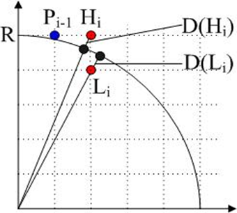

---
title: "复习 计算机图形学基础 第三章 -- 2. 圆生成算法"
date: 2023-06-16T18:12:19+08:00
tags: ["计算机图形学"]
categories: ["期末复习"]
series: ["复习 计算机图形学基础"]
---



### 圆的生成算法

#### Bresenham画圆算法
**基本原理**  

设与当前圆周最近的像素点是 \\(P_{i-1}(x_i-1,y_i-1)\\)  
下一个与圆周最近的像素点只能是正右方的点 \\(H_i(xi_-1+1,y_i-1)\\) 或者是右下方的点 \\(L_i(x_i-1+1,y_i-1-1)\\)

做判别式 \\(d_i\\) 的增量计算：  
\\(d_i\\) 的初值为 
$$
d_1 = 3 - 2R
$$  

若 \\(d_i<0\\) ，表示 \\(H_i\\) 点更接近圆周，点亮 \\(H_i\\) ，并递推出 \\(d_{i+1}\\)：
$$
d_{i+1} = d_i+4x_{i-1}+6
$$

若 \\(d_i\geq0\\) ，表示 \\(L_i\\) 点更接近圆周，点亮 \\(L_i\\) ，并递推出 \\(d_{i+1}\\)：
$$
d_{i+1} = = d_i+4(x_{i-1}-y_{i-1})+10
$$

递推出1/8圆弧后，即可利用圆的对称性获得整个圆的点。

> 例：
> 使用Bresenham算法画圆心(0,0)，半径R=5的圆，写出1/8圆弧的判定过程：  
> 根据圆心和半径可知，第一个点为 \\((0,5)\\)  
> \\(d_1 = 3 - 2R = -7\\)
> |X|Y|\\(d_i\\)|操作|
> |---|---|---|---|
> |0|5|-7| \\(d_i < 0\\)，y不变|
> |1|5|-1| \\(d_i < 0\\)，y不变|
> |2|5|9| \\(d_i \geq 0\\)，y值-1|
> |3|4|7|完成|

