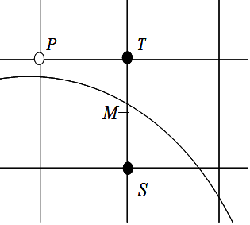

---
title: "复习 计算机图形学基础 第三章 -- 2. 圆生成算法"
date: 2023-06-16T18:12:19+08:00
tags: ["计算机图形学"]
categories: ["期末复习"]
series: ["复习 计算机图形学基础"]
---



## Bresenham画圆算法

设与当前圆周最近的像素点是 \\(P_{i-1}(x_i-1,y_i-1)\\)  
下一个与圆周最近的像素点只能是正右方的点 \\(H_i(xi_-1+1,y_i-1)\\) 或者是右下方的点 \\(L_i(x_i-1+1,y_i-1-1)\\)

做判别式 \\(d_i\\) 的增量计算：  
\\(d_i\\) 的初值为 
$$
Δ重点 \ \ 
d_1 = 3 - 2R
$$  

若 \\(d_i<0\\) ，选择 \\(H_i\\) 点为下一个绘制的像素（X轴+1，Y轴不变），并递推出 \\(d_{i+1}\\)：
$$
Δ重点 \ \ 
d_{i+1} = d_i+4x_i+6
$$

若 \\(d_i\geq0\\) ，选择 \\(L_i\\) 点为下一个绘制的像素（X轴+1，Y轴-1），并递推出 \\(d_{i+1}\\)：
$$
Δ重点 \ \ 
d_{i+1} = d_i+4(x_i-y_i)+10
$$

递推出1/8圆弧后，即可利用圆的对称性获得整个圆的点。

> 注意，当绘制的圆圆心不为(0,0)时，先设圆心为(0,0)，然后将计算出的绘制点的坐标加上原来的圆心位置即可。

> 例：
> 使用Bresenham算法画圆心(0,0)，半径R=5的圆，写出1/8圆弧的判定过程：  
> 根据圆心和半径可知，第一个点为 \\((0,5)\\)  
> \\(d_1 = 3 - 2R = -7\\)
> |X|Y|\\(d_i\\)|操作|
> |---|---|---|---|
> |0|5|-7| \\(d_i < 0\\)，y不变|
> |1|5|-1| \\(d_i < 0\\)，y不变|
> |2|5|9| \\(d_i \geq 0\\)，y值-1|
> |3|4|7|完成|

## 中点画圆算法
中点画圆算法与Bresenham画圆算法类似，利用圆的对称性，只需要讨论1/8圆弧。

假设P为当前点亮象素，那么下一个点亮的象素可能是 \\(T(x_p+1, y_p)\\) 或 \\(S(x_p+1, y_p - 1)\\)  
如果忽略圆心位置，那么根据圆的方程，可以构造一个函数\\(F(x,y)\\)：
$$
F(x,y)=x^2+y^2-r^2
$$

将重点M的代入函数F，可推断出：
- 若F(M)<0，M在圆内，此时下一个点取T；
- 若F(M)≥0，M在圆上或圆外，此时下一个点取S。

那么可以通过计算判别式 \\(d_i=F(M)\\) 来对下一个绘制像素进行选择  
d的初值为：
$$
\begin{split}
Δ重点\ \ 
d_0&=F(0+1,r-0.5) \\\
&=1+(r-0.5)^2-r^2 \\\
&=1.25-r
\end{split}
$$

如果 \\(d_i<0\\)，则选择T为下一个绘制的像素（X轴+1，Y轴不变），并递推出 \\(d_{i+1}\\):
$$
\begin{split}
Δ重点\ \ 
𝑑_{i+1}=𝐹(𝑀)&=𝐹(𝑥_i+2,𝑦_i−0.5) \\\
&=(𝑥_i+2)^2+(𝑦_i−0.5)^2−𝑟^2 \\\
&=𝑑+2𝑥_i+3
\end{split}
$$

如果 \\(d_i \geq 0\\)，则选择S为下一个绘制的像素（X轴+1，Y轴-1），并递推出 \\(d_{i+1}\\):
$$
\begin{split}
Δ重点\ \ 
𝑑_{i+1}&=𝐹(𝑥_i+2,𝑦_i−1.5) \\\
&=(𝑥_i+2)^2+(𝑦_i−1.5)^2−𝑟^2 \\\
&=𝑑+(2𝑥_i+3)+(−2𝑦_i+2)\\\ 
&=𝑑+(2𝑥_i−2𝑦_i+5)
\end{split}
$$

递推出1/8圆弧后，即可利用圆的对称性获得整个圆的点。
> 注意，当绘制的圆圆心不为(0,0)时，先设圆心为(0,0)，然后将计算出的绘制点的坐标加上原来的圆心位置即可。

> 例：使用中点画圆算法画圆心(1,2)，半径R=5的圆：  
> 设圆心为(0,0)  
> 根据圆心和半径可知，第一个点为 \\((0,5)\\)  
> |X|Y|\\(d_i\\)|操作|
> |---|---|---|---|
> |0|5|-4.25| \\(d_i < 0\\)，y不变|
> |1|5|-1.25| \\(d_i < 0\\)，y不变|
> |2|5|3.75| \\(d_i \geq 0\\)，y值-1|
> |3|4|4.75|完成|