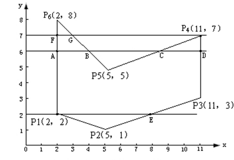

---
title: "复习 计算机图形学基础 第三章 -- 3. 区域填充"
date: 2023-06-16T21:44:58+08:00
tags: ["计算机图形学"]
categories: ["期末复习"]
series: ["复习 计算机图形学基础"]
---

## 多边形填充算法
### 多边形扫描转换算法
扫描线算法是确定水平扫描线与多边形的相交区间，把该区间内的所有像素一次性赋以新的颜色值。  
算法分为4个步骤：
1. 求交：计算扫描线与多边形所有边的交点
2. 排序：按x轴排序所有交点
3. 交点配对：每对交点代表扫描线与多边形的一个相交区域
4. 区间填色：根据相交区域填色

以X轴为扫描线轴使用多边形扫描转换算法的步骤：



1. 求角：扫描线 `y=6` 与多边形的边界交于 A,B,C,D 点，得到交点为 (2,6),(4,6),(8,6),(11,6)
2. 排序：按照交点的x值排序，2->4->8->11
3. 配对：每两个交点表示了多边形的一块区域，此时有两块区域，[(2,6),(4,6)]和[(8,6),(11,6)]
4. 把每个区域中的像素填充

按照上面的步骤，在Y轴上遍历扫描线，直到整个图形被填充

### TODO...

### 种子填充算法
在填充图像区域的内部找到一个像素（种子点）的基础上，通过邻近搜索向外扩散式填充。  
种子填充算法分为4连通和8连通方式，即进行邻近搜索时搜索 "上下左右"四个像素（四联通）或是"上下左右左上右上左下右下"八个像素，八联通算法相对于四连通跨越性更强（因为可以扫描对角方向）。


基于堆栈而非递归的4连通种子填充算法实现步骤：
1. 将栈顶点出栈
2. 填充该点
3. 检查上、下、左、右方的四个像素，如果像素不是边界点，且其颜色未被填充为目标颜色，则将其入栈
4. 循环执行前三步，直到栈空

```cpp
void FloodFill4(Vector2 startPoint, const GLubyte newColor[3], const GLubyte boundaryColor[3])
{
    stack<Vector2> _stack = stack<Vector2>();
    _stack.push(startPoint);

    while (!_stack.empty())
    {
        auto point = _stack.top();
        _stack.pop();

        cout << "Position:" << point.x << ' ' << point.y << endl;
        GLubyte color[3];
        glReadPixels(point.x, point.y, 1, 1,GL_RGB,GL_UNSIGNED_BYTE, color); //读取像素颜色
        if (color[0] == boundaryColor[0] && color[1] == boundaryColor[1] && color[2] == boundaryColor[2]
            || color[0] == newColor[0] && color[1] == newColor[1] && color[2] == newColor[2]) //若与填充颜色/边界颜色相等则停止
        {
            continue;
        }

        //绘制
        DrawDot(point, newColor);

        //连通
        _stack.push(Vector2(point.x - 1, point.y));
        _stack.push(Vector2(point.x, point.y + 1));
        _stack.push(Vector2(point.x + 1, point.y));
        _stack.push(Vector2(point.x, point.y - 1));
    }
}
```

### 基于扫描线的种子填充算法

