---
title: "复习 计算机图形学基础 第三章 基本图元生成算法 -- 3. 区域填充"
date: 2023-06-16T21:44:58+08:00
tags: ["计算机图形学"]
categories: ["期末复习"]
series: ["复习 计算机图形学基础"]
series_order: 5
---



## 多边形填充算法
### 多边形扫描转换算法
#### 概述
扫描线算法是确定水平扫描线与多边形的相交区间，把该区间内的所有像素一次性赋以新的颜色值。  
算法分为4个步骤：
1. 求交：计算扫描线与多边形所有边的交点
2. 排序：按x轴排序所有交点
3. 交点配对：每对交点代表扫描线与多边形的一个相交区域
4. 区间填色：根据相交区域填色

以X轴为扫描线轴使用多边形扫描转换算法的步骤：

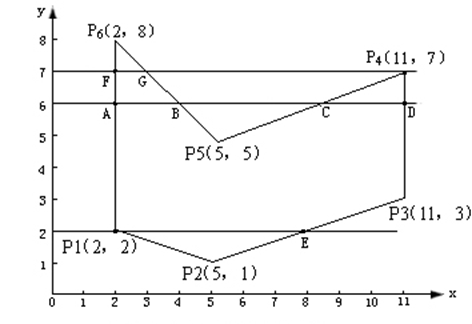

1. 求角：扫描线 `y=6` 与多边形的边界交于 A,B,C,D 点，得到交点为 (2,6),(4,6),(8,6),(11,6)
2. 排序：按照交点的x值排序，2->4->8->11
3. 配对：每两个交点表示了多边形的一块区域，此时有两块区域，[(2,6),(4,6)]和[(8,6),(11,6)]
4. 把每个区域中的像素填充

按照上面的步骤，在Y轴上遍历扫描线，直到整个图形被填充

---

#### 具体算法实现步骤
- **构造边表（ET）**
    1. 构造一个列表，该列表称为**边表**，长度为该多边形的扫描线的数量（即多边形在y轴上的跨度），表中的每一个元素都是一个链表，代表着每一条扫描线（方程\\(y=n\\，n为扫描线所在y轴上的位置)，每条扫描线称为**桶**
    2. 将多边形中每条边的信息链入与该边最小y坐标(\\(y_{low}\\))相对应的桶中。也就是说，**若某边的较低端点为(x,\\(y_{low}\\))，则该边就放在 \\(y=y_{low}\\) 这条扫描线对应的桶中**
    3. 每条边的数据为链表的一个节点，内容包含三个值：
        1. 该边和对应扫描的初始交点（即**较低端点**）的x值 \\(x_{low}\\)
        2. 该边最大y坐标（即**较高端点**）的y值 \\(y_{high}\\)
        3. 该边的斜率的倒数 \\(\frac{1}{k}\\)
    4. 同一个桶中的节点按照 \\(x_{low}\\) 从小到大排序，如果 \\(x_{low}\\) 相等，则按照 \\(\frac 1 k\\)来排序
    
    下面的例子构造了一个边表：
    
    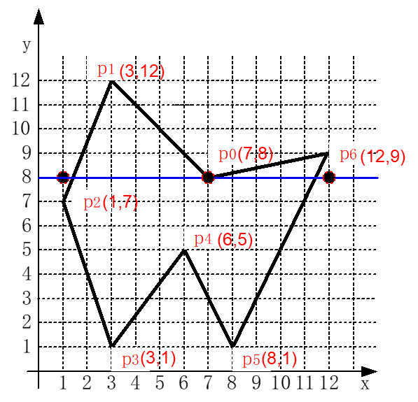
    |边|\\(y_{low}\\)|\\(x_{low}\\)|\\(y_{high}\\)|\\(\frac 1 k\\)|
    |---|---|---|---|---|
    |p0p1|8|7|12|-1|
    |p1p2|7|1|12|2/5|
    |p2p3|1|3|7|-1/3|
    |p3p4|1|3|5|3/4|
    |p4p5|1|8|5|-1/2|
    |p5p6|1|8|9|1/2|
    |p6p0|8|7|9|5|

    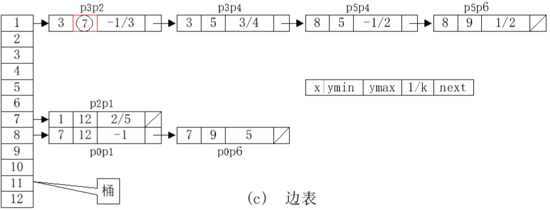

- **构造活动边表（AET）**
    根据构造的**边表（ET）**，进行扫描转换。对于不同的扫描线，与其相交的边线也是不同的，当对某一条扫描线进行扫描转换时，我们只需要考虑与它相交的那些边线  
    因此，需要建立一个只与当前扫描线相交的边记录链表，称之为**活动边表（AET）**  
    1. 构造一个链表，作为**活动边表**
    2. 按照y轴遍历每条扫描线，取出该扫描线在**边表**中对应的**桶**，放入**活动边表**，同时在边表中删除该桶，**然后将活动边表中的每个节点按照 \\(x_{low}\\) 排序**
    3. 如果桶中节点的 \\(y_{max}\\) 值**小于或等于**当前扫描线的y值，那么移除该节点
    4. 在当前活动边表中，取两两节点的 \\(x_{low}\\) 值，作为该扫描线的填充区域并填充多边形
    5. 将桶中每个节点的 \\(x_{min}\\) 值加上其 \\(\frac 1 k\\)的值
    6. 重复2-5，遍历下一条扫描线，直到边表和活动边表都为空

    对上述的多边形构造活动边表并填充：

    - 从 y=1 开始遍历扫描线，将边表中下标为1的桶加入活动边表并排序，取两两节点进行填充，最终填充范围是3-3和8-8：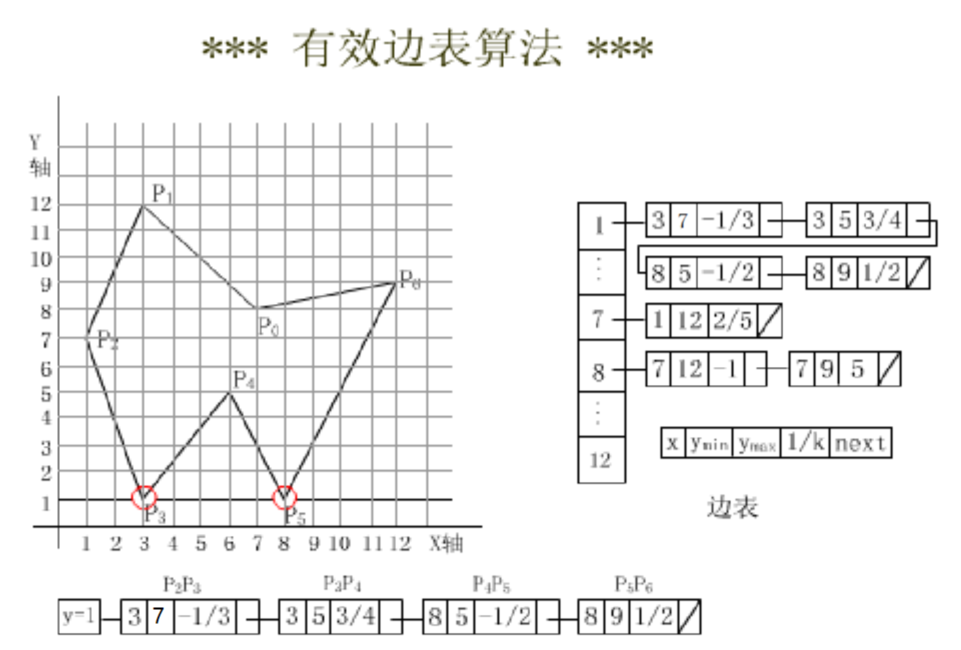
    - 将活动边表中所有节点的\\(x_{low}\\)加上\\(\frac 1 k\\)的值。然后切换到下一条扫描线 y=2，边表中对应的桶为空，对AET排序并继续填充，此时填充范围为 3-4和8-9（如果\\(x_{low}\\)有小数则四舍五入）：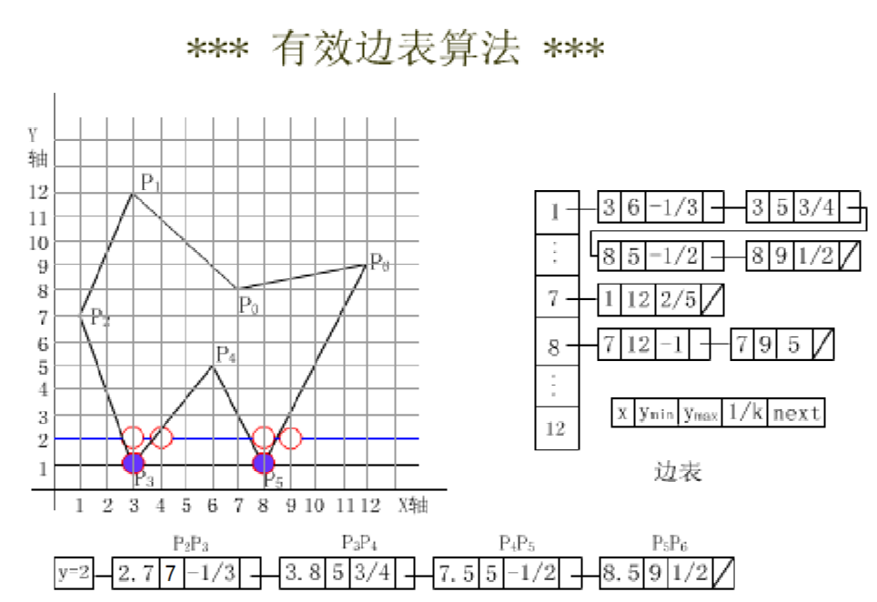
    - 与上一步操作相同，此时扫描线 y=3 的填充范围为 2-5和7-9：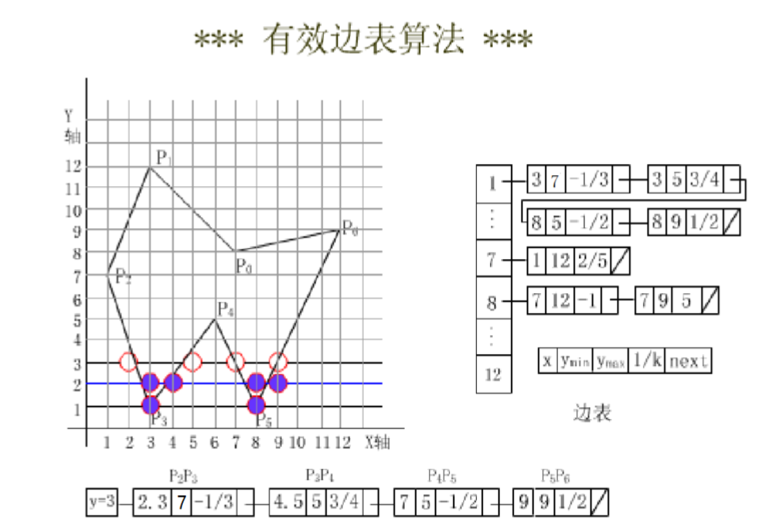
    - y=4，填充范围为 2-5和7-10：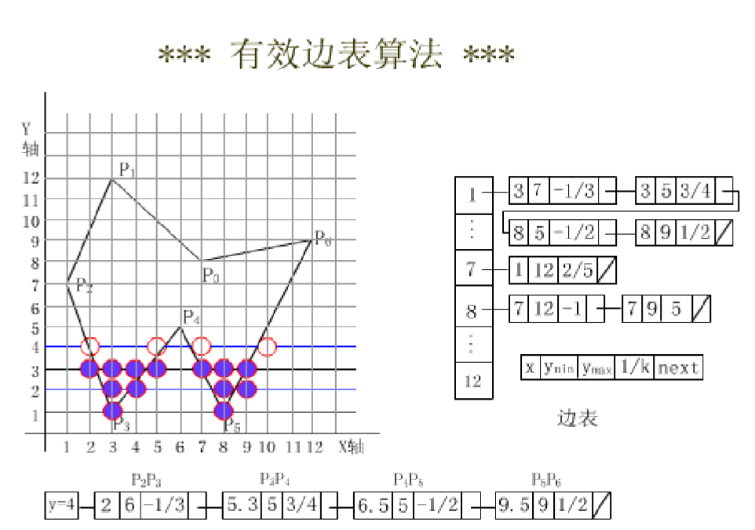
    - y=5，此时要AET中的边 p2p4和p4p5 的 \\(y_{max}\\) 值等于扫描线的 y 值，将这两个节点移除。然后排序，继续填充，范围为 2-10：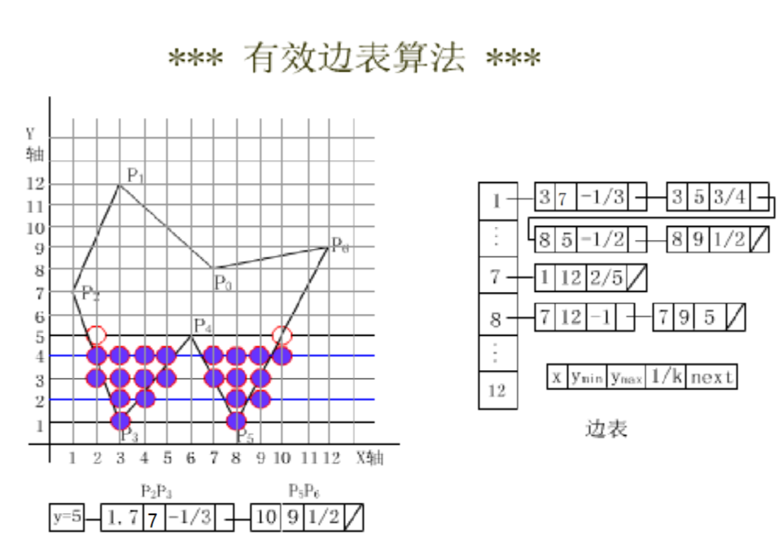
    - y=6，填充范围 1-11：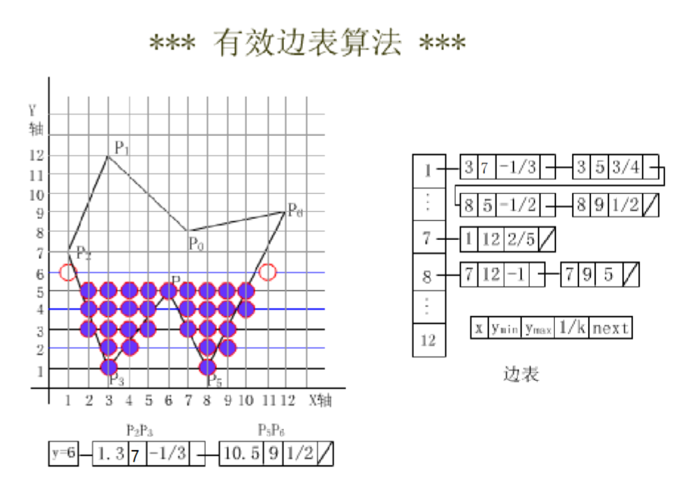
    - y=7，AET中的 p2p3 节点的 \\(y_{max}\\) 等于7，将其移除，加入ET中的 p2p1 节点然后排序，计算填充范围 1-11：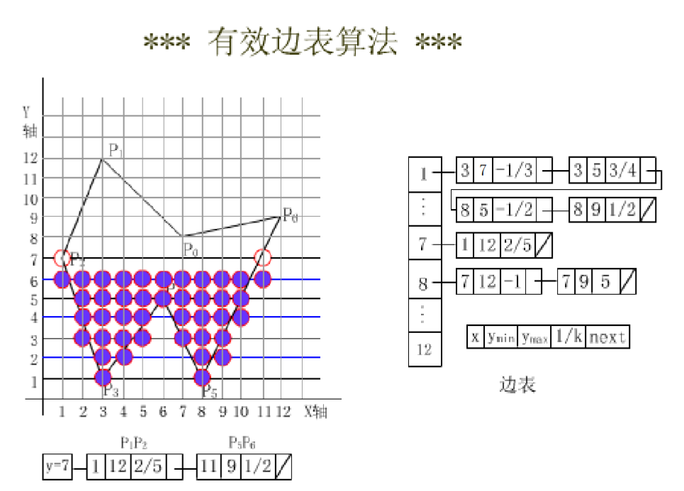
    - y=8，加入ET中的 p0p1和p0p6 节点，排序，然后计算填充范围为：1-7和7-12：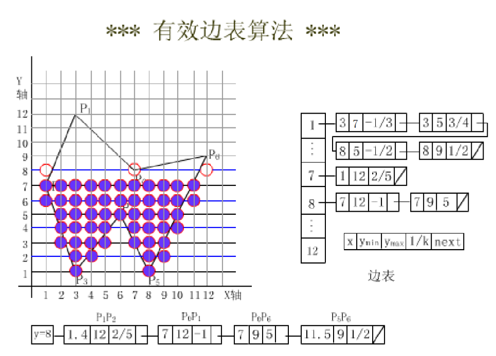
    - y=9，移除AET中的 p0p6和p5p6 节点，排序，然后计算填充范围：2-6：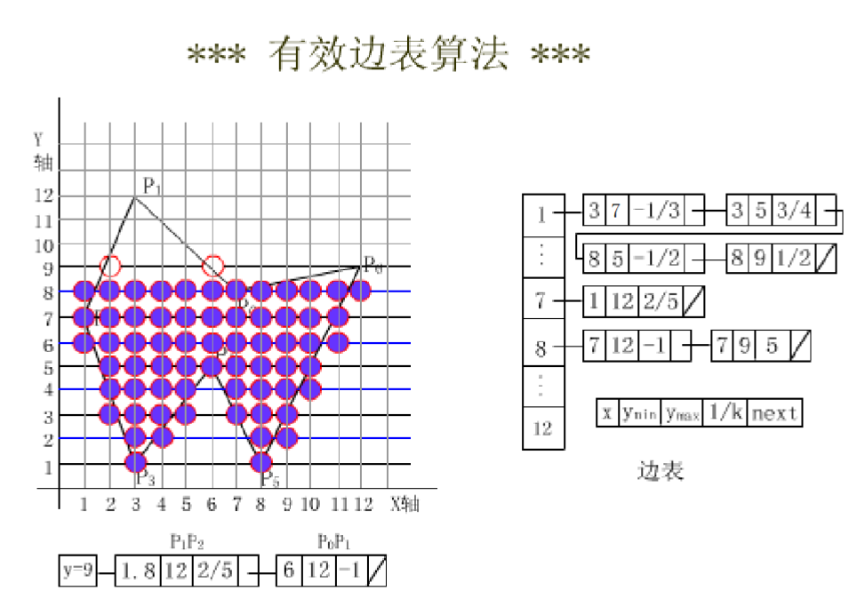
    - 不断填充，最后在 扫描线 y=12时，AET和ET中的节点全部被移除，填充完毕：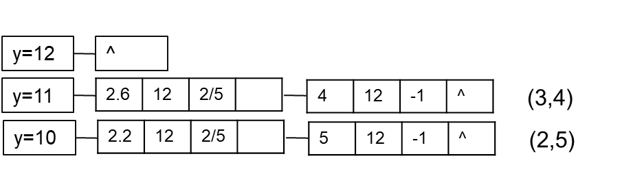
    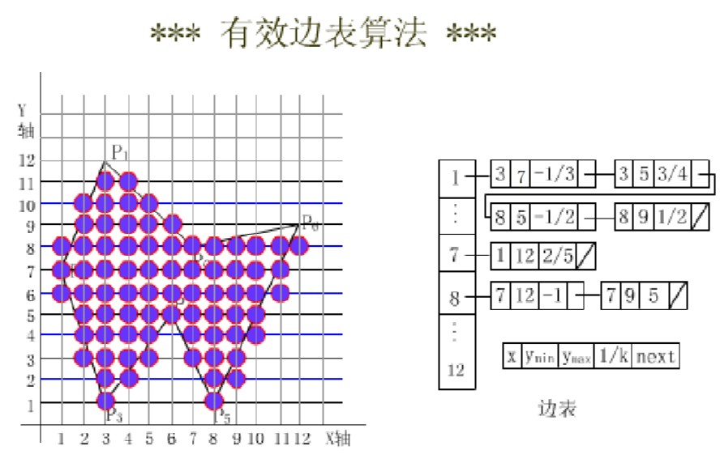


### 种子填充算法
在填充图像区域的内部找到一个像素（种子点）的基础上，通过邻近搜索向外扩散式填充。  
种子填充算法分为4连通和8连通方式，即进行邻近搜索时搜索 "上下左右"四个像素（四联通）或是"上下左右左上右上左下右下"八个像素，八联通算法相对于四连通跨越性更强（因为可以扫描对角方向）。

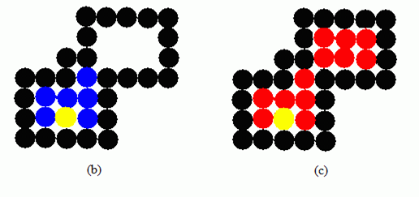

基于堆栈而非递归的4连通种子填充算法实现步骤：
1. 初始化栈，并将种子点入栈
2. 将栈顶点出栈
3. 填充该点
4. 检查上、下、左、右方的四个像素，如果像素不是边界点，且其颜色未被填充为目标颜色，则将其入栈
5. 循环执行前三步，直到栈空

```cpp
void FloodFill4(Vector2 startPoint, const GLubyte newColor[3], const GLubyte boundaryColor[3])
{
    stack<Vector2> _stack = stack<Vector2>();
    _stack.push(startPoint);

    while (!_stack.empty())
    {
        auto point = _stack.top();
        _stack.pop();

        cout << "Position:" << point.x << ' ' << point.y << endl;
        GLubyte color[3];
        glReadPixels(point.x, point.y, 1, 1,GL_RGB,GL_UNSIGNED_BYTE, color); //读取像素颜色
        if (color[0] == boundaryColor[0] && color[1] == boundaryColor[1] && color[2] == boundaryColor[2]
            || color[0] == newColor[0] && color[1] == newColor[1] && color[2] == newColor[2]) //若与填充颜色/边界颜色相等则停止
        {
            continue;
        }

        //绘制
        DrawDot(point, newColor);

        //连通
        _stack.push(Vector2(point.x - 1, point.y));
        _stack.push(Vector2(point.x, point.y + 1));
        _stack.push(Vector2(point.x + 1, point.y));
        _stack.push(Vector2(point.x, point.y - 1));
    }
}
```

### 基于扫描线的种子填充算法
找到一个图形内的像素点（种子点），通过X轴扫描线对图像进行填充  
实现步骤为：
1. 初始化栈并将种子点入栈
2. 栈顶点出栈，以该点的水平线作为当前的扫描线
3. 从该点出发，沿着当前扫描线左右两方向填充，直到填充到边界。最左端的填充像素和最右端的分别记为 \\(X_l\\)和 \\(X_r\\)  
4. 在区间[\\(X_l,X_r\\)]范围内，搜索每个像素点的上方像素（一般是从左到右）是否未填充且不是边界。如果发现，则将上方每个未填充像素区间（可能有多个非连通的未填充区间）的最左边的（或是最右，依题意）像素入栈
5. 和第4步一致，只不过搜索的是下方的像素点
6. 重复2-5，直到栈空（依题意，第4步和第5步的顺序可能调换）

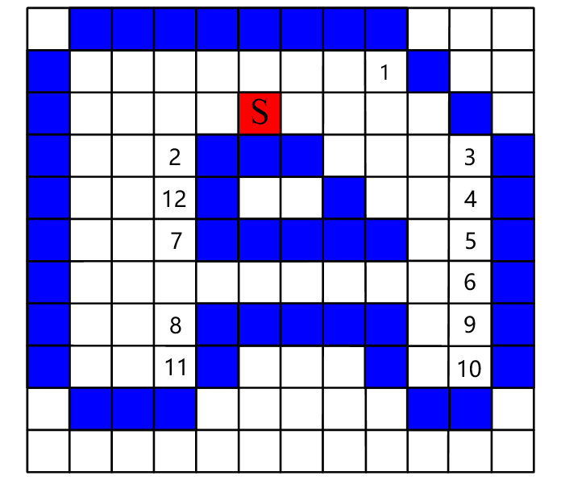