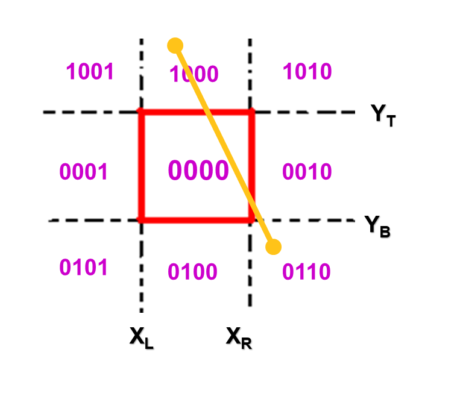
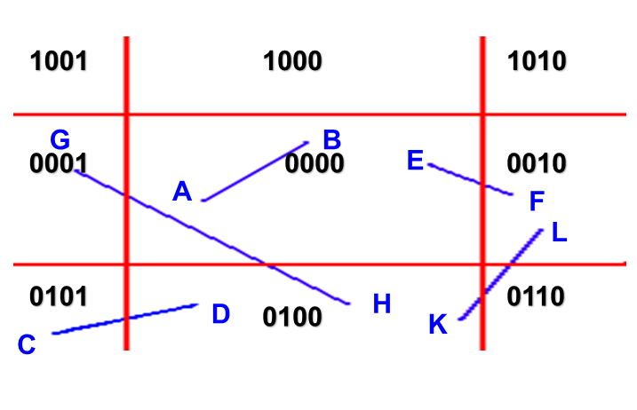
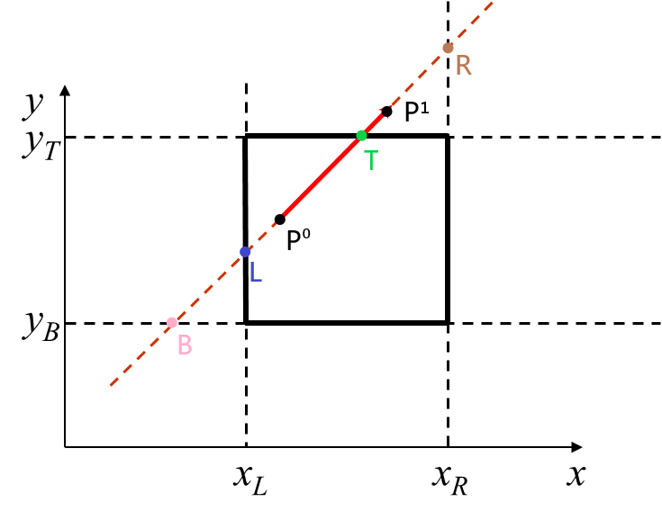

---
title: "复习 计算机图形学基础 第三章 基本图元生成算法 -- 5. 图像裁剪"
date: 2023-06-17T20:20:26+08:00
tags: ["计算机图形学"]
categories: ["期末复习"]
series: ["复习 计算机图形学基础"]
series_order: 7
---



## 直线裁剪
使用一个矩形窗口，对直线进行裁剪，保留矩形框内的直线段，移除矩形框外的。

### Cohen-Sutherland裁剪算法
该算法的主要思想为：对于每条线段，分为3种情况处理：
1. 线段完全在窗口内，则不进行裁剪，称为“取”
2. 线段完全在窗口外，则丢弃整条线段，称为“弃”
3. 如果线段部分在窗口内而部分在窗口外，则将线段分割，窗口外的弃，窗口内的取

Cohen-Sutherland使用编码空间划分的方法快速确定直线与矩形窗口的位置关系，避免了频繁地对直线和矩形框取交点。如下图所示，将矩形窗口外的八个方向以及窗口内共9个区域使用一串区域编码来表示：



```cpp
enum Code
{
    INSIDE = 0,
    LEFT = 1,
    RIGHT = 2,
    BOTTOM = 4,
    TOP = 8,
};

Code Encode(Vector2f& point, Rect& rect)
{
    int c = INSIDE;
    if (point.x < rect.x_left)
        c = c | LEFT;
    else if (point.y > rect.x_right)
        c = c | RIGHT;
    if (point.y < rect.y_bottom)
        c = c | BOTTOM;
    else if (point.y > rect.y_top)
        c = c | TOP;

    return static_cast<Code>(c);
}
```

  

对一条直线的两个端点进行区域编码，判断直线与矩形窗口的位置关系：  
- 如果两个端点的编码均为 0000，则代表整条线段都在矩形框内，取之。（比如图中的直线AB）
- 如果两个端点的编码的**逻辑与**不为0000，则这条线段完全在矩形框外，弃之。（比如图中的直线CD：0101 & 0100 = 0100）
- 然而上一步并不能去除所有的完全在矩形框外的直线（比如图中的KL），此时需要对剩余的直线进行可见性判定：
    1. 求出直线与矩形框的所有交点
    2. 如果没有交点，说明直线完全在矩形框外，弃之（如图中的KL）
    3. 判断交点个数：
        - 如果有一个交点，说明直线一端在矩形框外，另一端在矩形框内（如图中的EF），此时，取交点以及直线位于矩形框内的端点成新的直线
        - 如果有两个交点，说明直线两端都在矩形框外，线段贯穿矩形框（如图中的GH），此时，取两个交点为新的直线

```cpp
Line Cohen_Sutherland(const Line& line, Rect& rect)
{
    auto code1 = Encode(*line.begin, rect);
    auto code2 = Encode(*line.end, rect);
    auto result = line;

    //线段在切割范围外，返回空
    if ((code1 & code2) != INSIDE)
        return {nullptr, nullptr};

    //若两点均在切割范围内，则返回整条线段
    while (code1 != INSIDE || code2 != INSIDE)
    {
        //端点在切割范围外
        if ((code1 & code2) != INSIDE)
            break;

        //选取非范围内端点
        auto code = code1 == INSIDE ? code2 : code1;

        auto p = new Vector2f();
        //线段与左边缘相交
        if ((code & LEFT) != INSIDE)
        {
            p->x = rect.x_left;
            p->y = line.begin->y + (line.end->y - line.begin->y) * (rect.x_left - line.begin->x) / (line.end->x - line.
                begin->x); //求交点
        }
        //右边缘相交
        else if ((code & RIGHT) != INSIDE)
        {
            p->x = rect.x_right;
            p->y = line.begin->y + (line.end->y - line.begin->y) * (rect.x_right - line.begin->x) / (line.end->x - line.
                begin->x);
        }
        //下边缘相交
        else if ((code & BOTTOM) != 0)
        {
            p->y = rect.y_bottom;
            p->x = line.begin->x + (line.end->x - line.begin->x) * (rect.y_bottom - line.begin->y) / (line.end->y - line
                .begin->y);
        }
        //上边缘相交
        else
        {
            p->y = rect.y_top;
            p->x = line.begin->x + (line.end->x - line.begin->x) * (rect.y_top - line.begin->y) / (line.end->y - line.
                begin->y);
        }

        //选取的为begin
        if (code == code1)
        {
            result.begin = p;
            //重新计算端点编码
            code1 = Encode(*p, rect);
        }
        else
        {
            result.end = p;
            code2 = Encode(*p, rect);
        }
    }
    return result;
}
```

### Liang-Barsky算法
<!-- Liang-Barsky算法的基本思路：  
  
如图所示，设要裁剪的线段是 \\(P_0P_1\\) ，点\\(P_0和P_1\\) 已确定。  
设直线 \\(P_0P_1\\) 的延长线和窗口边界的延长线交于 `L、R、B、T` 四点。此时需要确定直线的裁剪点。  
观察上图可以发现，通过**求 [B,L,\\(P_0\\)] 中最靠近\\(P_1\\)点的**，可以确定直线的一个裁剪点。而相对的，**求 [T,R,\\(P_1\\)] 中最靠近\\(P_0\\)点的**，可以确定直线的另一个裁剪点。  

比如图中的直线，[B,L,\\(P_0\\)] 中最靠近\\(P_1\\)点的为\\(P_0\\)点，[T,R,\\(P_1\\)]点中最靠近\\(P_0\\)点的为T点。因此，可知要对该直线裁剪，只需要取\\(P_0\\)点和T点即可。

现在的问题是，如何确定 `L,R,B,T` 四个点？

Liang-Barsky算法使用参数方程来表示一条直线：
$$
\begin{split}
x &= x_0 + Δx \centerdot t \\\
y &= y_0 + Δy \centerdot t\ \ \ (0 \leq t \leq 1) \\\
Δx &= x_1 - x_0 \ \ Δy = y_1 - y_0
\end{split}
$$

将窗口边界的四条边分为两类：始边和终边  
设\\(x_L,x_R,y_T,y_B\\)分别为窗口的左，右，上，下边界  

- 若\\(Δx \geq 0\\)，\\(x_L\\)为始边，\\(x_R\\)为终边。  
- 若\\(Δx < 0\\)，\\(x_R\\)为始边，\\(x_L\\)为终边。  

- 若\\(Δy \geq 0\\)，\\(y_B\\)为始边，\\(y_Y\\)为终边。  
- 若\\(Δy < 0\\)，\\(y_T\\)为始边，\\(y_B\\)为终边。  
 -->
