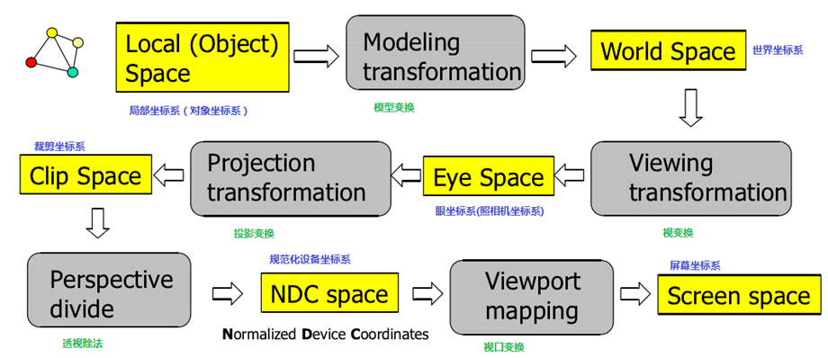

---
title: "复习 计算机图形学基础 第五章 三维观察"
date: 2023-06-18T14:25:36+08:00
tags: ["计算机图形学"]
categories: ["期末复习"]
series: ["复习 计算机图形学基础"]
series_order: 9
---

## 三维观察变换
OpenGL中的坐标处理包括模型变换、视变换、投影变换、视口变换等内容，如下图所示：

三维观察的处理流程为：
1. 局部坐标（对象坐标）变换 -> 

## 常用的OpenGL三维观察变换的函数
1. 模型变换
    - 平移： `glTranslate`
    - 旋转： `glRotate`
    - 缩放： `glScale`
2. 视变换： `glLookAt`
3. 投影变换
    - 正交投影： `glOrthO`
    - 投影变换（对称）： `glPerspective`
    - 投影变换（非对称）： `glFrustum`
4. 视口变换： `glViewPort`
