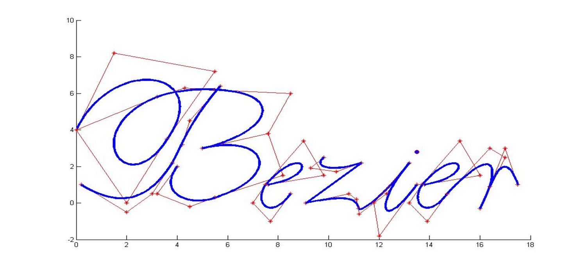

---
title: "复习 计算机图形学基础 第六章 三维对象"
date: 2023-06-18T14:47:37+08:00
tags: ["计算机图形学"]
categories: ["期末复习"]
series: ["复习 计算机图形学基础"]
series_order: 10
---



## 实体造型
三维对象的实体造型分为两种：
1. **规则对象**，即能使用欧氏几何（点，线，面）进行描述的对*，如点，线，平面，曲面，实体等
2. **不规则对象**，不能使用欧氏几何描述的对象，如植被，树木，水体，云雾等

## 实体造型方法
对实体造型的表示方法分为三种：
1. **边界表示**，即用一组曲面（含平面）来描述物体，这些曲面将物体分为内部和外部。边界表示具体又包括多边形表面模型和扫描表示两种。
2. **构造实体几何表示**，将实体表示成立 方体、长方体、圆柱体、圆锥体等基本体素的组合，可以采用并、交、差等运算构造新的形体。
3. **空间分割表示**，用来描述物体的内部性质，将包含一物体的空间区域划分成一组小的、非重叠的、连续实体（通常是立方体）。

## 曲线
### 贝塞尔曲线

给定 n+1 个数据点，\\(p_0 (x_0,y_0)…p_n(x_n,y_n)\\)，生成一条曲线，要求曲线尽可能地逼近这些数据点。

#### 