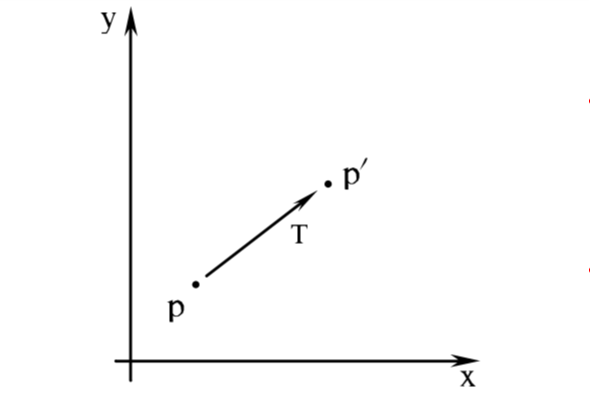
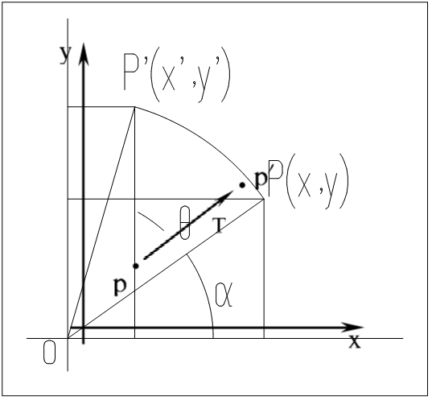
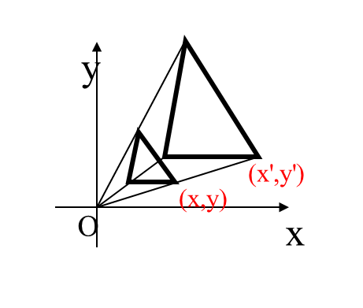

---
title: "复习 计算机图形学基础 第四章"
date: 2023-06-17T22:14:39+08:00
tags: ["计算机图形学"]
categories: ["期末复习"]
series: ["复习 计算机图形学基础"]
---



## 二维几何变换
### 向量矩阵
基本几何变换都是相对于坐标原点和坐标轴进行的几何变换。  
在计算机中，若要对整个图形进行几何变换，只需要将该图形的所有顶点进行相同的几何变换即可。  
一般使用一个**向量矩阵**来存储图形的一个顶点，如：
\\(
P =
\begin{bmatrix}
x \\\
y
\end{bmatrix}
\\)  
通过对图形每个顶点的向量矩阵进行各种计算，即可对该图形进行几何变换

### 平移变换
对一个图形进行平移，只需对其顶点的向量矩阵加上各个轴的偏移量即可：

$$
P' = P + T \\\
P = 
\begin{bmatrix}
x \\\
y
\end{bmatrix}
\ \ \ 
T = 
\begin{bmatrix}
t_x \\\
t_y
\end{bmatrix}
\\\ 
P' = 
\begin{bmatrix}
x+t_x \\\
y+t_x
\end{bmatrix}=
\begin{bmatrix}
x' \\\
y'
\end{bmatrix}
$$

### 旋转变换
**绕坐标原点的旋转变换**
设旋转角度为 θ

$$
P' = RP \\\
R = 
\begin{bmatrix}
cos θ & -sin θ\\\
sin θ & cos θ
\end{bmatrix}
\ \ \ 
P =
\begin{bmatrix}
x \\\
y
\end{bmatrix}
\\\
P' = 
\begin{bmatrix}
cos θ & -sin θ\\\
sin θ & cos θ
\end{bmatrix}
\begin{bmatrix}
x \\\
y
\end{bmatrix}=
\begin{bmatrix}
xcosθ-ysinθ \\\
xsinθ+ycosθ
\end{bmatrix}
$$

> 如果某个顶点 \\(P_0(X_0,0_Y)\\) 要绕某个特定点 \\(P_r(X_r,Y_r)\\) 旋转θ度，只需要将该点设为原点，接着计算 \\(P_0\\) 点对 \\(P_r\\) 点的相对坐标 \\(P_t(X_t,Y_t)\\) ，使用 \\(P_t\\) 点进行绕坐标原点的旋转变换得出目标点 \\(P_1(X_1,Y_1)\\)，然后以该 \\(P_1\\) 点作为偏移量对 \\(P_0\\) 点进行平移变换即可。

### 缩放变换
**以坐标原点为基准点的缩放变换**
设缩放率为 \\(S_x, S_y\\)

$$
P' = SP \\\
P =
\begin{bmatrix}
x \\\
y
\end{bmatrix}
\ \ \ 
S =
\begin{bmatrix}
S_x & 0 \\\
0 & S_y
\end{bmatrix}
\\\
P' = 
\begin{bmatrix}
S_x & 0 \\\
0 & S_y
\end{bmatrix}
\begin{bmatrix}
x \\\
y
\end{bmatrix}
\begin{bmatrix}
S_x \centerdot x \\\
S_y \centerdot y
\end{bmatrix}
$$

> 注意：  
> 这样的缩放变换以坐标原点为放缩参照点  
> 它不仅改变了物体的大小和形状，也改变了它离原点的距离  

### 对称变换
#### 关于X轴的对称变换
$$
\begin{bmatrix}
x' \\\
y'
\end{bmatrix}=
\begin{bmatrix}
1 & 0 \\\
0 & -1
\end{bmatrix}=
\begin{bmatrix}
x \\\
-y
\end{bmatrix}
$$
#### 关于Y轴的对称变换
$$
\begin{bmatrix}
x' \\\
y'
\end{bmatrix}=
\begin{bmatrix}
-1 & 0 \\\
0 & 1
\end{bmatrix}
\begin{bmatrix}
x \\\
y
\end{bmatrix}=
\begin{bmatrix}
x \\\
-y
\end{bmatrix}
$$
#### 关于对角线y=x对称变换
$$
\begin{bmatrix}
x' \\\
y'
\end{bmatrix}=
\begin{bmatrix}
0 & 1 \\\
1 & 0
\end{bmatrix}
\begin{bmatrix}
x \\\
y
\end{bmatrix}=
\begin{bmatrix}
x \\\
-y
\end{bmatrix}
$$
#### 关于对角线y=-x对称变换
$$
\begin{bmatrix}
x' \\\
y'
\end{bmatrix}=
\begin{bmatrix}
0 & -1 \\\
-1 & 0
\end{bmatrix}
\begin{bmatrix}
x \\\
y
\end{bmatrix}=
\begin{bmatrix}
x \\\
-y
\end{bmatrix}
$$
#### 关于原点对称
即先对对角线y=x对称，再对对角线y=-x对称
$$
\begin{bmatrix}
x' \\\
y'
\end{bmatrix}=
\begin{bmatrix}
0 & 1 \\\
1 & 0
\end{bmatrix}
\begin{bmatrix}
0 & -1 \\\
-1 & 0
\end{bmatrix}
\begin{bmatrix}
x \\\
y
\end{bmatrix}=
\begin{bmatrix}
-1 & 0 \\\
0 & -1
\end{bmatrix}
\begin{bmatrix}
x \\\
y
\end{bmatrix}=
\begin{bmatrix}
x \\\
-y
\end{bmatrix}
$$

## 齐次坐标
根据上面的二维几何变换，可以得出，每个基本变换（平移、旋转、缩放等）都可以表示为下列形式：
$$
P' = M_1P+M_2
$$
其中P'和P表示为坐标的向量矩阵，\\(M_1\\) 是一个包含乘法系数的 `2*2` 的矩阵， \\(M_2\\) 是包含加法系数的 `2*1` 的矩阵。  
- 对于平移变换， \\(M_1\\) 是一个单位矩阵，只需要对 \\(M_2\\) 进行加法运算即可。  
- 对于旋转，缩放或是对称变换，对 \\(M_1\\) 进行乘法运算。  

如果要对图形进行复合变换，必须一步一步地计算图形顶点的向量矩阵的每一次变换。并且为了防止图形产生畸变，还要遵守[**“先缩放，再旋转，后平移”**](https://blog.csdn.net/zsq306650083/article/details/50561857)的原则。  

因此，更有效的方法是将不同类型的变换组合，从而直接从初始坐标得到最后的坐标位置，消除中间坐标值的计算，因此引入了**齐次坐标**。  

齐次坐标就是由 n+1 维向量表示一个 n 维向量。如果是2维几何变换，那就是用一个 `3*3` 的矩阵来表示原本 `2*2` 的矩阵。然后将所有的变换公式表达为矩阵乘法。  

将一个顶点的向量矩阵转换为齐次矩阵：
$$
P = 
\begin{bmatrix}
x \\\
y \\\
1
\end{bmatrix}
$$
其中第三个值 `1` 称为哑坐标，决定了坐标的缩放比，一个点的齐次坐标是不唯一的，例如，普通坐标系下的点 `(2,3)` 变换为齐次坐标可以是 `(2,3,1)、(1,1.5,0.5)、(4,6,2)` 等。如果坐标是无穷大，哑坐标可以表示为`0`。  

然后，利用齐次坐标，可以得到二维图形变换矩阵的通式：
  
由上图所示，将比例、反射、旋转和错切变换整合到 `a,b,c,d` 四个值中，将平移变换整合到 `m,n` 中，将投影变换转换到 `p,q` 中，将缩放变换转换到哑坐标 `s` 中。  

如果要对一个顶点进行几何变换，将该通式 T 与顶点的齐次坐标相乘即可：
$$
\begin{split}
P' &= TP \\\
\begin{bmatrix}
x' \\\
y' \\\
H
\end{bmatrix}&=
\begin{bmatrix}
a & c & m \\\
b & d & n \\\
p & q & s
\end{bmatrix}
\begin{bmatrix}
x \\\
y \\\
1
\end{bmatrix}
\end{split}
$$

## 使用齐次坐标的二维几何变换
### 平移变换
$$
\begin{bmatrix}
x' \\\
y' \\\
1
\end{bmatrix}=
\begin{bmatrix}
1 & 0 & t_x \\\
0 & 1 & t_y \\\
0 & 0 & 1
\end{bmatrix}
\begin{bmatrix}
x \\\
y \\\
1
\end{bmatrix}
$$
### 旋转变换
$$
\begin{bmatrix}
x' \\\
y' \\\
1
\end{bmatrix}=
\begin{bmatrix}
cosθ & -sinθ & 0 \\\
sinθ & cosθ & 0 \\\
0 & 0 & 1
\end{bmatrix}
\begin{bmatrix}
x \\\
y \\\
1
\end{bmatrix}
$$
### 缩放变换
$$
\begin{bmatrix}
x' \\\
y' \\\
1
\end{bmatrix}=
\begin{bmatrix}
1 & 0 & 0 \\\
0 & 1 & 0 \\\
0 & 0 & s
\end{bmatrix}
\begin{bmatrix}
x/s \\\
y/s \\\
1
\end{bmatrix}
$$
### 对称变换
#### 关于x轴对称
$$
\begin{bmatrix}
x' \\\
y' \\\
1
\end{bmatrix}=
\begin{bmatrix}
1 & 0 & 0 \\\
0 & -1 & 0 \\\
0 & 0 & 1
\end{bmatrix}
\begin{bmatrix}
x \\\
y \\\
1
\end{bmatrix}
$$
#### 关于y轴对称
$$
\begin{bmatrix}
x' \\\
y' \\\
1
\end{bmatrix}=
\begin{bmatrix}
-1 & 0 & 0 \\\
0 & 1 & 0 \\\
0 & 0 & 1
\end{bmatrix}
\begin{bmatrix}
x \\\
y \\\
1
\end{bmatrix}
$$
#### 关于对角线y=x的对称
$$
\begin{bmatrix}
x' \\\
y' \\\
1
\end{bmatrix}=
\begin{bmatrix}
0 & 1 & 0 \\\
1 & 0 & 0 \\\
0 & 0 & 1
\end{bmatrix}
\begin{bmatrix}
x \\\
y \\\
1
\end{bmatrix}
$$
#### 关于对角线y=-x的对称
$$
\begin{bmatrix}
x' \\\
y' \\\
1
\end{bmatrix}=
\begin{bmatrix}
0 & -1 & 0 \\\
-1 & 0 & 0 \\\
0 & 0 & 1
\end{bmatrix}
\begin{bmatrix}
x \\\
y \\\
1
\end{bmatrix}
$$
#### 关于原点的对称
$$
\begin{bmatrix}
x' \\\
y' \\\
1
\end{bmatrix}=
\begin{bmatrix}
-1 & 0 & 0 \\\
0 & -1 & 0 \\\
0 & 0 & 1
\end{bmatrix}
\begin{bmatrix}
x \\\
y \\\
1
\end{bmatrix}
$$
